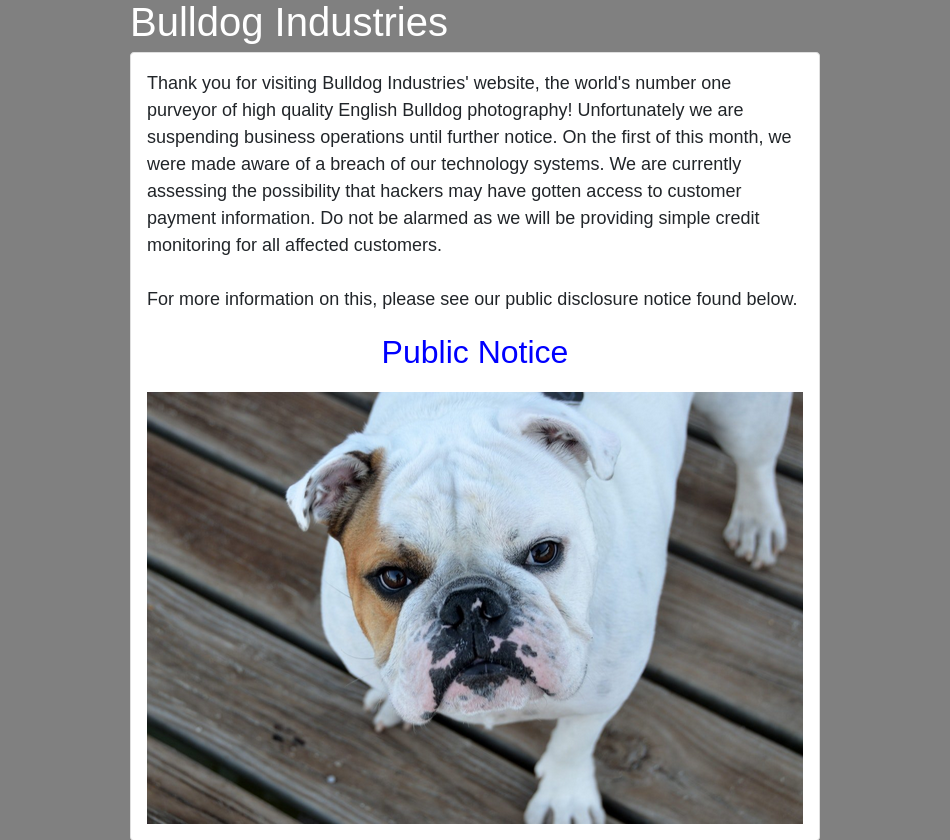
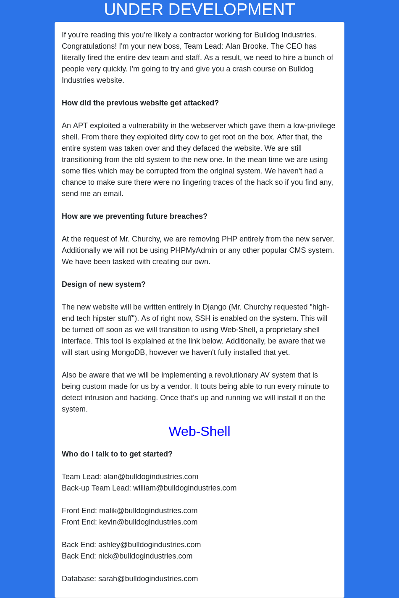

[vulnhub - easy/medium] bulldog: 1
----------------------------------

### enumeration
Since the machine's ip is already shown at its login page, I decide to check it on my browser to see if there's any useful information in it:

But there isn't relevant info on the page (even after reading the source code) nor in the "Public Notice" link above the bulldog photo (except for text, that is, which could be used in CeWL if it comes to that). Running exiftoon on the photo also doesn't give me anything useful, just the cheeky nod:
```bash
Comment                         : Not a part of the VM, he's just cute :3 https://www.pexels.com/photo/white-and-brown-bulldog-on-brown-wood-planks-160748/
```
I then proceed to run nmap on all ports:
```bash
┌──(j㉿kali)-[~/Desktop/vulnhub/bulldog-1]
└─$ nmap -p- -T4 -oA nmap_info_allports 192.168.56.117
Starting Nmap 7.92 ( https://nmap.org ) at 2022-10-26 11:36 -03
Nmap scan report for 192.168.56.117
Host is up (0.00014s latency).
Not shown: 65532 closed tcp ports (conn-refused)
PORT     STATE SERVICE
23/tcp   open  telnet
80/tcp   open  http
8080/tcp open  http-proxy

Nmap done: 1 IP address (1 host up) scanned in 0.87 seconds
```
After that, detailed nmap on the detected ports:
```bash
┌──(j㉿kali)-[~/Desktop/vulnhub/bulldog-1]
└─$ nmap -p 23,80,8080 -sC -sV -oA nmap_info_detailed 192.168.56.117
Starting Nmap 7.92 ( https://nmap.org ) at 2022-10-26 11:38 -03
Nmap scan report for 192.168.56.117
Host is up (0.00062s latency).

PORT     STATE SERVICE VERSION
23/tcp   open  ssh     OpenSSH 7.2p2 Ubuntu 4ubuntu2.2 (Ubuntu Linux; protocol 2.0)
| ssh-hostkey: 
|   2048 20:8b:fc:9e:d9:2e:28:22:6b:2e:0e:e3:72:c5:bb:52 (RSA)
|   256 cd:bd:45:d8:5c:e4:8c:b6:91:e5:39:a9:66:cb:d7:98 (ECDSA)
|_  256 2f:ba:d5:e5:9f:a2:43:e5:3b:24:2c:10:c2:0a:da:66 (ED25519)
80/tcp   open  http    WSGIServer 0.1 (Python 2.7.12)
|_http-title: Bulldog Industries
|_http-server-header: WSGIServer/0.1 Python/2.7.12
8080/tcp open  http    WSGIServer 0.1 (Python 2.7.12)
|_http-title: Bulldog Industries
|_http-server-header: WSGIServer/0.1 Python/2.7.12
Service Info: OS: Linux; CPE: cpe:/o:linux:linux_kernel

Service detection performed. Please report any incorrect results at https://nmap.org/submit/ .
Nmap done: 1 IP address (1 host up) scanned in 17.03 seconds
zsh: segmentation fault  nmap -p 23,80,8080 -sC -sV -oA nmap_info_detailed 192.168.56.117
```
The port 8080 is serving the same thing as the port 80, so I proceed to use gobuster to bruteforce probable directories.
```bash
┌──(j㉿kali)-[~/Desktop/vulnhub/bulldog-1]
└─$ gobuster dir -u http://192.168.56.117/ -o gobuster_info -w /usr/share/wordlists/dirbuster/directory-list-2.3-medium.txt -x html,txt,php
===============================================================
Gobuster v3.1.0
by OJ Reeves (@TheColonial) & Christian Mehlmauer (@firefart)
===============================================================
[+] Url:                     http://192.168.56.117/
[+] Method:                  GET
[+] Threads:                 10
[+] Wordlist:                /usr/share/wordlists/dirbuster/directory-list-2.3-medium.txt
[+] Negative Status codes:   404
[+] User Agent:              gobuster/3.1.0
[+] Extensions:              html,txt,php
[+] Timeout:                 10s
===============================================================
2022/10/26 11:43:47 Starting gobuster in directory enumeration mode
===============================================================
/admin                (Status: 301) [Size: 0] [--> http://192.168.56.117/admin/]
/dev                  (Status: 301) [Size: 0] [--> http://192.168.56.117/dev/]  
/robots.txt           (Status: 200) [Size: 1071]                                
/notice               (Status: 301) [Size: 0] [--> http://192.168.56.117/notice/]
Progress: 63900 / 882244 (7.24%)                                                ^C
[!] Keyboard interrupt detected, terminating.
                                                                                 
===============================================================
2022/10/26 11:45:21 Finished
===============================================================
```
The /dev/ directory found by gobuster seems to have interesting information on it. At surface level, this is what it looks like:

But when viewing the page source, we find the following commented out:
```html
    <!--Need these password hashes for testing. Django's default is too complex-->
	<!--We'll remove these in prod. It's not like a hacker can do anything with a hash-->
	Team Lead: alan@bulldogindustries.com<br><!--6515229daf8dbdc8b89fed2e60f107433da5f2cb-->
	Back-up Team Lead: william@bulldogindustries.com<br><br><!--38882f3b81f8f2bc47d9f3119155b05f954892fb-->
	Front End: malik@bulldogindustries.com<br><!--c6f7e34d5d08ba4a40dd5627508ccb55b425e279-->
	Front End: kevin@bulldogindustries.com<br><br><!--0e6ae9fe8af1cd4192865ac97ebf6bda414218a9-->
	Back End: ashley@bulldogindustries.com<br><!--553d917a396414ab99785694afd51df3a8a8a3e0-->
	Back End: nick@bulldogindustries.com<br><br><!--ddf45997a7e18a25ad5f5cf222da64814dd060d5-->
	Database: sarah@bulldogindustries.com<br><!--d8b8dd5e7f000b8dea26ef8428caf38c04466b3e-->
```